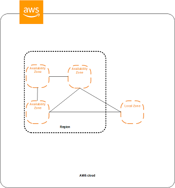

# AWS

AWS Identity and Access Management (IAM) is a web service that helps you securely control access to AWS resources. You use IAM to control who is authenticated (signed in) and authorized (has permissions) to use resources.

## EC2
    可以理解为虚拟机。
    上线代码方式：推荐Docker

Amazon EC2 is hosted in multiple locations world-wide. These locations are composed of Regions, Availability Zones, and Local Zones. Each Region is a separate geographic area. Each Region has multiple, isolated locations known as Availability Zones. Local Zones provide you the ability to place resources, such as compute and storage, in multiple locations closer to your end users. Resources aren't replicated across Regions unless you specifically choose to do so.

### Region, Availability Zone, and Local Zone Concepts
Each Region is completely independent. Each Availability Zone is isolated, but the Availability Zones in a Region are connected through low-latency links. A Local Zone is an AWS infrastructure deployment that places select services closer to your end users. A Local Zone is an extension of a Region that is in a different location from your Region. It provides a high-bandwidth backbone to the AWS infrastructure and is ideal for latency-sensitive applications, for example machine learning. The following diagram illustrates the relationship between Regions, Availability Zones, and Local Zones.

An Availability Zone is represented by a Region code followed by a letter identifier; for example, _us-east-1a_.

| Code |   Name  |  Opt-in Status | Local Zone |
| ---- | ------- | -------------- | ---------- |
| us-east-2 | US East (Ohio) | Not required | No |
| us-east-1 | US East (N. Virginia) | Not required | No |

### Availability Zones（可用区）
前面我们说到，每个 vailability Zone必须有子网，可是，这到底是什么意思呢？在AWS中，为了保证每个地区资源的极高的可用性。每个区域（zone）的资源都被划分为2个或更多不同可用区（AZ）。对每个区域（zone）来说，基本上即使其他所有AZ都中断了，也要确保至少有一个AZ还能正常运行。

## VPC
    虚拟局域网，一个路由下面的一个局域网。
    VPC包含公有子网和私有子网，公有子网可以直接访问公网，但私有子网不能，需要通过NAT，NAT可以理解为路由器(网关)。
    NAT可以用EC2实例来制作。
    AWS也提供了NAT服务（推荐）。

VPC（Virtual Private Cloud），虚拟私有云，是你的基础设施所运行在的一个私有网络空间。你可以自己选择VPC的地址空间（CIDR 范围），例如10.0.0.0/16  。这将决定VPC内有多少可分配IP 。因为VPC内的每一台服务器都需要一个IP地址，所以VPC地址空间的大小，将决定该私有网络可容纳的资源上限。 10.0.0.0/16地址空间的可用地址从10.0.0.0到10.0.255.255, 一共2^16，65,536个IP地址。

VPC是AWS中最基础的基础，每一个新创建的账户，在每个AZ（Available Zone，可用区），都包含一个带子网的默认VPC 。

### Subnet（子网）
subnet（子网）是VPC的一部分，有其单独的CIDR范围和流量转发规则。其CIDR范围是VPC的一个子集。举个栗子，10.0.0.0 的一个子网 10.0.1.0/24，地址范围从10.0.10.0到10.0.1.255，一共256个IP地址。

根据是否可以从外部（公网）访问进来，子网也经常被称为“公有”或“私有”子络。这种可见度是由网络路由规则控制的，每个子网都有其自己的规则。子网必须位于某个区域具体的AZ中，因此，在每个区域划分子网是很好的做法。如果你要划分公有子网和私有子网，那么，在每个AZ都要有一套。

### Sercurity Group
A security group acts as a virtual firewall for your EC2 instances to control incoming and outgoing traffic. Inbound rules control the incoming traffic to your instance, and outbound rules control the outgoing traffic from your instance. When you launch an instance, you can specify one or more security groups.

- Security group rules are always permissive; you can't create rules that deny access.
- Security group rules enable you to filter traffic based on protocols and port numbers.
- Security groups are stateful—if you send a request from your instance, the response traffic for that request is allowed to flow in regardless of inbound security group rules.
- When you associate multiple security groups with an instance, the rules from each security group are effectively aggregated to create one set of rules.

VPC 网络安全组标志 VPC 中的哪些流量可以发往 EC2 实例或从 EC2 发出。安全组指定具体的入向和出向流量规则，并精确到源地址（入向）和目的地址（出向）。这些安全组是与 EC2 实例而非子网关联的。
默认情况下，流量只允许出，不允许入。
入向规则可具体指定源地址——CIDR 段或者另一个安全组亦或是端口范围。当指定的源地址为另一个安全组时，该安全组必需位于同一个 VPC 。例如，VPC 默认的安全组允许任意来自同一安全组的访问流量。如果将该安全组应用于 VPC 内创建的所有资源，那么该 VPC 中的资源之间将可以互通。

•实例 (i-67890) 的安全组 (sg-abcde) 允许来自 443 端口的 TCP 流量•来自 IP 10.0.1.123 22 端口的请求不被允许通过•来自 443 端口的请求被允许通过

### IAM Policy
To allow IAM users to create or modify resources and perform tasks, you must create IAM policies that grant IAM users permission to use the specific resources and API actions they'll need, and then attach those policies to the IAM users or groups that require those permissions.

### IAM Role
You can only attach one IAM role to an instance, but you can attach the same role to many instances.

ARN:Amazon Resource Name

cloudwatch

## RDS
    关系型数据库的管理平台。
    可以选择不同数据库，比如mysql。可以创建主从库，并且有多个从库。
    kingshard中间件，可以管理数据库的主从分离，负载均衡。

## ElastiCache
    缓存系统管理平台。（Memcache）

## ELB
    Elastic Load Balance，可伸缩负载均衡。私有子网中的服务要通过ELB暴露到公网。

## AutoScaling
    自动缩小或扩容的工具。通过管理EC2的启动配置来管理EC2数量。

S3

ROUTE 53

## AWS CLI

### aws configure

file??

### Routing Tables（路由表）
路由表，是一系列规定子网IP数据包如何传输到其他不同IP地址的规则。每个VPC内，都有一个默认的路由表，只允许流量在本地（VPC内部）转发。如果某个子网没有关联路由表，则使用该默认路由，也就是一个“私有”子网。如果你想要能从外部访问子网，那么你就需要创建一个路由表，显式地指定该规则。这样，关联该路由表的子网就是“公有”子网。

### Internet Gateways（互联网网关）
将子网配置为可从外部访问的路由表，需要借助互联网网关来控制外部数据包出入VPC。例如，创建一个网关，配置规则为所有去往 0.0.0.0/0 的数据包均需通过网关。

### NAT Gateways（NAT 网关）
如果你有一台在AWS私有子网内，不允许公网访问的EC2实例，那么该实例的数据也没办法发送到公网。我们需要一种机制，将数据包发出去，并且正确地接收到对端的响应包。这便是 NAT ——网络地址转换，跟家里的 wifi 路由器很类似。
NAT 网关是位于公有子网的一个设备，负责接收从私有子网发往公网的数据包，转发至其目的地址；同时转发返回的数据包到源地址。
如果你 VPC 中私有子网中的实例不需要公网访问的话，那么 NAT 并不是必需的。只有你的实例需要访问诸如外部 API，SaaS 数据库等时，你才需要配置 NAT 网关。或者是使用 AWS 提供的 NAT 网关资源（由 AWS 配置，更易于用户管理）。

•NAT 网关位于公有子网中•从私有子网发出对某个公网地址的请求•根据路由表规则，请求数据包被转发到 NAT 网关•NAT 网关将数据包转发出去

Certificate Management