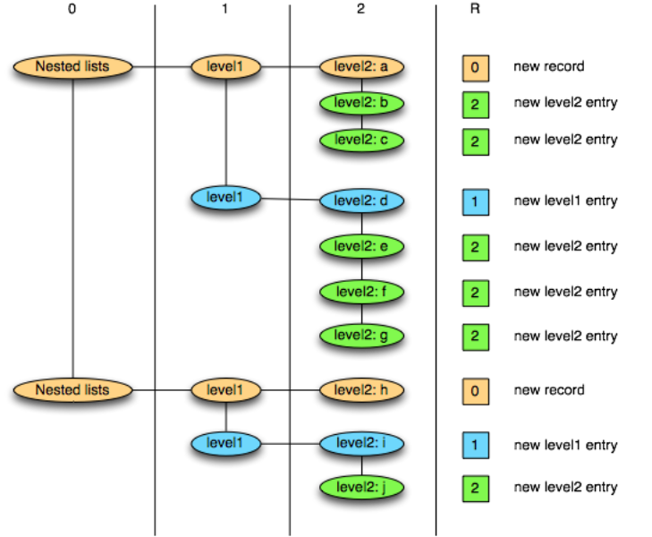

# Big Data

## Hadoop
开源大数据框架和分布式计算系统。

两大核心：

1.HDFS分布式文件系统，存储。（Hadoop Distributed File System）

	1. 数据块: 128MB 备份x3
	2. NameNode: 主，管理命名空间，存放文件元数据，维护所有文件与数据块的映射，记录各个块所在数据节点信息。
	3. DataNode：从，存储数据块，向namenode更新数据块列表。

	有容错，恢复，支持流式写入，一次写入，多次读取。
	不适合大量小文件存储，不适合并发写入，不支持随机修改，不支持随机读等低延时访问。

	数据块大小？太小内存压力大，太大加载慢？？

	主节点挂了？Hadoop2.0支持HA，有备用节点。

HDFS写流程：

	客户端向NameNode发请求。
	分块写入DataNode，DataNode自动备份。
	DataNode通知NameNode，NameNode通知客户端。

HDFS读流程：

	客户端向NameNode发请求。
	NameNode找到最近DataNode。
	客户端从该DataNode下载文件。

2.MapReduce分布式计算
一种编程模型，分而治之。

	输入一个大文件，分片，每片文件交给单独的机器去处理，这就是Map方法。
	各个结果再汇总得到最终结果，这就是Reduce方法。


## Hadoop YARN
YARN的全称是Yet Another Resource Negotiator，另一种资源调度者。从Apache Hadoop 2.0开始，Hadoop包含YARN。

### Hadoop 1.x与Hadoop 2.x
先回头看一下Hadoop1.x对MapReduce job的调度管理方式。在Hadoop 1.x版本中，MapReduce(也称MRv1)既要负责资源管理又要负责作业处理。MapReduce（MRv1）运行时环境由（一个）JobTracker和（若干个）TaskTracker两类服务组成。其中，JobTracker负责资源管理和所有作业的控制，而TaskTracker负责接收来自JobTracker的命令并执行它。该框架在扩展性、容错性和多框架支持等方面存在不足，这也促使了MRv2的产生。

在Apache Hadoop 2.x中，我们将MapReduce(MRv1)分解为Apache Hadoop YARN，一种通用的分布式应用程序管理框架，而Apache Hadoop MapReduce（又称MRv2）仍然是一个纯粹的分布式计算框架。
MRv2是在运行于资源管理框架YARN之上的计算框架MapReduce。它的运行时环境不再由JobTracker和TaskTracker等服务组成，而是变为通用资源管理系统YARN和作业控制进程ApplicationMaster。简言之，MRv1仅是一个独立的离线计算框架，而MRv2则是运行于YARN之上的MapReduce。

YARN是Hadoop 2.x中的资源管理系统，它是一个通用的资源管理模块，可为各类应用程序进行资源管理和调度。YARN不仅限于MapReduce一种框架使用，也可以供其他框架使用，比如Hive、Spark、Storm等。由于YARN的通用性，下一代MapReduce的核心已经从简单的支持单一应用的计算框架MapReduce转移到通用的资源管理系统YARN。

### YARN架构
YARN的架构还是经典的主从（master/slave）结构，如下图所示。大体上看，YARN服务由一个ResourceManager（RM）和多个NodeManager（NM）构成，ResourceManager为主节点（master），NodeManager为从节点（slave）。


简单地说，YARN主要由ResourceManager、NodeManager、ApplicationMaster和Container等几个组件构成。

Container是Yarn对计算机计算资源的抽象，它其实就是一组CPU和内存资源，所有的应用都会运行在Container中。ApplicationMaster是对运行在Yarn中某个应用的抽象，它其实就是某个类型应用的实例，ApplicationMaster是应用级别的，它的主要功能就是向ResourceManager（全局的）申请计算资源（Containers）并且和NodeManager交互来执行和监控具体的task。
Scheduler是ResourceManager专门进行资源管理的一个组件，负责分配NodeManager上的Container资源，NodeManager也会不断发送自己Container使用情况给ResourceManager。

（1）ResourceManager（RM）是一个全局的资源管理器，负责整个系统的资源管理和分配。RM有两个主要组件：调度器(Scheduler)和应用程序管理器(Applications Manager)。

调度器(Scheduler)，负责根据容量，队列等的熟悉约束，向各种运行的应用程序分配资源。调度程序是纯调度器，它不执行监视或跟踪应用程序的状态。此外，由于应用程序故障或硬件故障，它不能保证重新启动失败的任务。调度程序根据应用程序的资源需求执行其调度功能; 它基于包含诸如内存，cpu，磁盘，网络等元素的资源容器的抽象概念。YARN提供了多种直接可用的调度器,比如FairScheduler和Capacity Scheduler等。ApplicationsManager负责接受作业提交，协商第一个容器来执行应用程序特定的ApplicationMaster，并提供服务，以便在失败时重新启动ApplicationMaster容器。每个应用程序ApplicationMaster有责任从调度程序协商适当的资源容器，跟踪其状态并监视进度。

监控NodeManager

（2）ApplicationMaster (AM)
当用户提交一个应用程序时,需要提供一个用以跟踪和管理这个程序的ApplicationMaster（AM）,它负责向ResourceManager申请资源,并要求 NodeManger 启动可以占用一定资源的任务。
AM主要功能包括:

与 RM 调度器协商以获取资源(用 Container 表示);
将得到的任务进一步分配给内部的任务;
与 NM 通信以启动 / 停止任务;
监控所有任务运行状态,并在任务运行失败时重新为任务申请资源以重启任务。
ApplicationMaster 负责一个应用程序生命周期内的所有工作。但注意每一个 应用程序（不是每一种）都有一个 ApplicationMaster，它可以运行在 ResourceManager 以外的机器上。
数据切分

（3）NodeManager ( NM )
NM 是每个节点上的资源和任务管理器,一方面,它会定时地向 RM 汇报本节点上的资源使用情况和各个 Container 的运行状态;另一方面,它接收并处理来自 AM 的 Container启动 / 停止等各种请求。
NM 功能比较专一，就是负责 Container 状态的维护，并向 RM 保持心跳。

（4）Container
Container 是 YARN 中 的 资 源 抽 象, 它 封 装 了 某 个 节 点 上 的 多 维 度 资 源, 如 内 存、CPU、磁盘、网络等,当 AM 向 RM 申请资源时,RM 为 AM 返回的资源便是用 Container表示的。YARN 会为每个任务分配一个 Container,且该任务只能使用该 Container 中描述的资源。需要注意的是,Container 不同于 MRv1 中的 slot,它是一个动态资源划分单位,是根据应用程序的需求动态生成的。目前,YARN 仅支持 CPU 和内存两种资源,且使用了轻量级资源隔离机制 Cgroups 进行资源隔离。


### YARN工作流程
当用户向YARN中提交一个应用程序后,YARN将分两个阶段运行该应用程序 :第一个阶段是启动ApplicationMaster;第二个阶段是由ApplicationMaster创建应用程序,为它申请资源,并监控它的整个运行过程,直到运行完成。

1. 客户端程序向ResourceManager提交应用并请求一个ApplicationMaster实例。
2. ResourceManager进程和NodeManager进程通信，根据集群资源，为用户程序分配第一个容器，ResourceManager找到可以运行一个Container的NodeManager，并在这个Container中启动ApplicationMaster实例。
3. ApplicationMaster向ResourceManager进行注册，注册之后客户端就可以查询ResourceManager获得自己ApplicationMaster的详细信息，以后就可以和自己的ApplicationMaster直接交互了。
4. ApplicationMaster根据resource-request协议向ResourceManager发送resource-request请求，为自己的应用程序申请容器资源。
5. 当Container被成功分配之后，ApplicationMaster通过向NodeManager发送container-launch-specification信息来启动Container，container-launch-specification信息包含了能够让Container和ApplicationMaster交流所需要的资料。
6. 应用程序的代码在启动的Container中运行，并把运行的进度、状态等信息通过application-specific协议发送给ApplicationMaster。
7. 在应用程序运行期间，提交应用的客户端主动和ApplicationMaster交流获得应用的运行状态、进度更新等信息，交流的协议也是application-specific协议。
8. 一但应用程序执行完成并且所有相关工作也已经完成，ApplicationMaster向ResourceManager取消注册然后关闭，用到所有的Container也归还给系统


YARN的资源管理
1、资源调度和隔离是yarn作为一个资源管理系统，最重要且最基础的两个功能。资源调度由resourcemanager完成，而资源隔离由各个nodemanager实现。

2、Resourcemanager将某个nodemanager上资源分配给任务（这就是所谓的“资源调度”）后，nodemanager需按照要求为任务提供相应的资源，甚至保证这些资源应具有独占性，为任务运行提供基础和保证，这就是所谓的资源隔离。

3、当谈及到资源时，我们通常指内存、cpu、io三种资源。Hadoop yarn目前为止仅支持cpu和内存两种资源管理和调度。

4、内存资源多少决定任务的生死，如果内存不够，任务可能运行失败；相比之下，cpu资源则不同，它只会决定任务的快慢，不会对任务的生死产生影响。

Yarn的内存管理：
yarn允许用户配置每个节点上可用的物理内存资源，注意，这里是“可用的”，因为一个节点上内存会被若干个服务贡享，比如一部分给了yarn，一部分给了hdfs，一部分给了hbase等，yarn配置的只是自己可用的，配置参数如下：

yarn.nodemanager.resource.memory-mb

表示该节点上yarn可以使用的物理内存总量，默认是8192m，注意，如果你的节点内存资源不够8g，则需要调减这个值，yarn不会智能的探测节点物理内存总量。

yarn.nodemanager.vmem-pmem-ratio

任务使用1m物理内存最多可以使用虚拟内存量，默认是2.1

yarn.nodemanager.pmem-check-enabled

是否启用一个线程检查每个任务证使用的物理内存量，如果任务超出了分配值，则直接将其kill，默认是true。

yarn.nodemanager.vmem-check-enabled

是否启用一个线程检查每个任务证使用的虚拟内存量，如果任务超出了分配值，则直接将其kill，默认是true。

yarn.scheduler.minimum-allocation-mb

单个任务可以使用最小物理内存量，默认1024m，如果一个任务申请物理内存量少于该值，则该对应值改为这个数。

yarn.scheduler.maximum-allocation-mb

单个任务可以申请的最多的内存量，默认8192m

Yarn cpu管理：
目前cpu被划分为虚拟cpu，这里的虚拟cpu是yarn自己引入的概念，初衷是考虑到不同节点cpu性能可能不同，每个cpu具有计算能力也是不一样的，比如，某个物理cpu计算能力可能是另外一个物理cpu的2倍，这时候，你可以通过为第一个物理cpu多配置几个虚拟cpu弥补这种差异。用户提交作业时，可以指定每个任务需要的虚拟cpu个数。在yarn中，cpu相关配置参数如下：

yarn.nodemanager.resource.cpu-vcores

表示该节点上yarn可使用的虚拟cpu个数，默认是8个，注意，目前推荐将该值为与物理cpu核数相同。如果你的节点cpu合数不够8个，则需要调减小这个值，而yarn不会智能的探测节点物理cpu总数。

yarn.scheduler.minimum-allocation-vcores

单个任务可申请最小cpu个数，默认1，如果一个任务申请的cpu个数少于该数，则该对应值被修改为这个数

yarn.scheduler.maximum-allocation-vcores

单个任务可以申请最多虚拟cpu个数，默认是32.


## Spark
	基于内存计算的大数据并行计算框架。计算的中间值存在于内存中。
	MapReduce的替代方案。
	兼容HDFS，Hive等。
	本身是Scala开发，运行与JVM上。
	Hadoop的中间计算结果会落盘，导致计算时效差，不适用与交互处理，更适合离线处理。Spark基于内存，计算时间是秒级和分钟级。

	弹性分布式数据集RDD ???
	基于事件驱动？？？

	spark shell


spark-shell读取parquet文件。
```scala
val sqlContext = new org.apache.spark.sql.SQLContext(sc)
val parquetFile = sqlContext.parquetFile("/Users/wrma/Downloads/basic.parquet")
parquetFile.take(200).foreach(println)

// second way:
val p = spark.read.load("/Users/wrma/Downloads/basic.parquet")
// 查询 Schema 和数据
p.printSchema
p.show
p.show(10) //显示10行

p.select($"seller_network_id",$"postal_code",$"date").show
p.select($"seller_network_id",$"postal_code",$"date").write.save("/Users/wrma/Downloads/test.parquet")
```


Spark是个通用的集群计算框架，通过将大量数据集计算任务分配到多台计算机上，提供高效内存计算。如果你熟悉Hadoop，那么你知道分布式计算框架要解决两个问题：如何分发数据和如何分发计算。Hadoop使用HDFS来解决分布式数据问题，MapReduce计算范式提供有效的分布式计算。类似的，Spark拥有多种语言的函数式编程API，提供了除map和reduce之外更多的运算符，这些操作是通过一个称作弹性分布式数据集(resilient distributed datasets, RDDs)的分布式数据框架进行的。

本质上，RDD是种编程抽象，代表可以跨机器进行分割的只读对象集合。RDD可以从一个继承结构（lineage）重建（因此可以容错），通过并行操作访问，可以读写HDFS或S3这样的分布式存储，更重要的是，可以缓存到worker节点的内存中进行立即重用。由于RDD可以被缓存在内存中，Spark对迭代应用特别有效，因为这些应用中，数据是在整个算法运算过程中都可以被重用。大多数机器学习和最优化算法都是迭代的，使得Spark对数据科学来说是个非常有效的工具。另外，由于Spark非常快，可以通过类似Python REPL的命令行提示符交互式访问。

Spark库本身包含很多应用元素，这些元素可以用到大部分大数据应用中，其中包括对大数据进行类似SQL查询的支持，机器学习和图算法，甚至对实时流数据的支持。

#### 核心组件：

- Spark Core：包含Spark的基本功能；尤其是定义RDD的API、操作以及这两者上的动作。其他Spark的库都是构建在RDD和Spark Core之上的。
- Spark SQL：提供通过Apache Hive的SQL变体Hive查询语言（HiveQL）与Spark进行交互的API。每个数据库表被当做一个RDD，Spark SQL查询被转换为Spark操作。对熟悉Hive和HiveQL的人，Spark可以拿来就用。
- Spark Streaming：允许对实时数据流进行处理和控制。很多实时数据库（如Apache Store）可以处理实时数据。Spark Streaming允许程序能够像普通RDD一样处理实时数据。
- MLlib：一个常用机器学习算法库，算法被实现为对RDD的Spark操作。这个库包含可扩展的学习算法，比如分类、回归等需要对大量数据集进行迭代的操作。之前可选的大数据机器学习库Mahout，将会转到Spark，并在未来实现。
- GraphX：控制图、并行图操作和计算的一组算法和工具的集合。GraphX扩展了RDD API，包含控制图、创建子图、访问路径上所有顶点的操作。

Spark提供了使用Scala、Java和Python编写的API。

#### Spark编程
编写Spark应用与之前实现在Hadoop上的其他数据流语言类似。代码写入一个惰性求值的驱动程序（driver program）中，通过一个动作（action），驱动代码被分发到集群上，由各个RDD分区上的worker来执行。然后结果会被发送回驱动程序进行聚合或编译。本质上，驱动程序创建一个或多个RDD，调用操作来转换RDD，然后调用动作处理被转换后的RDD。

这些步骤大体如下：

1. 定义一个或多个RDD，可以通过获取存储在磁盘上的数据（HDFS，Cassandra，HBase，Local Disk），并行化内存中的某些集合，转换（transform）一个已存在的RDD，或者，缓存或保存。
2. 通过传递一个闭包（函数）给RDD上的每个元素来调用RDD上的操作。Spark提供了除了Map和Reduce的80多种高级操作。
3. 使用结果RDD的动作（action）（如count、collect、save等）。动作将会启动集群上的计算。

当Spark在一个worker上运行闭包时，闭包中用到的所有变量都会被拷贝到节点上，但是由闭包的局部作用域来维护。Spark提供了两种类型的共享变量，这些变量可以按照限定的方式被所有worker访问。广播变量会被分发给所有worker，但是是只读的。累加器这种变量，worker可以使用关联操作来“加”，通常用作计数器。

Spark应用本质上通过转换和动作来控制RDD。

#### Spark的执行
简略描述下Spark的执行。本质上，Spark应用作为独立的进程运行，由驱动程序中的SparkContext协调。这个context将会连接到一些集群管理者（如YARN），这些管理者分配系统资源。集群上的每个worker由执行者（executor）管理，执行者反过来由SparkContext管理。执行者管理计算、存储，还有每台机器上的缓存。

重点要记住的是应用代码由驱动程序发送给执行者，执行者指定context和要运行的任务。执行者与驱动程序通信进行数据分享或者交互。驱动程序是Spark作业的主要参与者，因此需要与集群处于相同的网络。这与Hadoop代码不同，Hadoop中你可以在任意位置提交作业给JobTracker，JobTracker处理集群上的执行。

#### 与Spark交互
使用Spark最简单的方式就是使用交互式命令行提示符。打开PySpark终端，在命令行中打出pyspark。PySpark将会自动使用本地Spark配置创建一个SparkContext。你可以通过sc变量来访问它。我们来创建第一个RDD。
```bash
>>> text = sc.textFile("BigData.md")
>>> print(text)
BigData.md MapPartitionsRDD[1] at textFile at NativeMethodAccessorImpl.java:0
```
textFile方法将BigData.md加载到一个RDD命名文本。如果查看了RDD，你就可以看出它是个MappedRDD，文件路径是相对于当前工作目录的一个相对路径。我们转换下这个RDD，来进行分布式计算的“hello world”：“字数统计”。
```bash
>>> from operator import add
>>> def tokenize(text):
...     return text.split()
...
>>> words=text.flatMap(tokenize)
>>> print(words)
PythonRDD[2] at RDD at PythonRDD.scala:53
```
我们首先导入了add操作符，它是个命名函数，可以作为加法的闭包来使用。我们稍后再使用这个函数。首先我们要做的是把文本拆分为单词。我们创建了一个tokenize函数，参数是文本片段，返回根据空格拆分的单词列表。然后我们通过给flatMap操作符传递tokenize闭包对textRDD进行变换创建了一个wordsRDD。你会发现，words是个PythonRDD，但是执行本应该立即进行。显然，我们还没有把整个莎士比亚数据集拆分为单词列表。

如果你曾使用MapReduce做过Hadoop版的“字数统计”，你应该知道下一步是将每个单词映射到一个键值对，其中键是单词，值是1，然后使用reducer计算每个键的1总数。

首先，我们map一下。
```bash
>>> wc = words.map(lambda x: (x,1))
>>> print wc.toDebugString()
b'(2) PythonRDD[3] at RDD at PythonRDD.scala:53 []\n |  BigData.md MapPartitionsRDD[1] at textFile at NativeMethodAccessorImpl.java:0 []\n |  BigData.md HadoopRDD[0] at textFile at NativeMethodAccessorImpl.java:0 []'
```
我使用了一个匿名函数（用了Python中的lambda关键字）而不是命名函数。这行代码将会把lambda映射到每个单词。因此，每个x都是一个单词，每个单词都会被匿名闭包转换为元组(word, 1)。为了查看转换关系，我们使用toDebugString方法来查看PipelinedRDD是怎么被转换的。可以使用reduceByKey动作进行字数统计，然后把统计结果写到磁盘。
```bash
>>> counts = wc.reduceByKey(add)
>>> counts.saveAsTextFile("wc")
```
一旦我们最终调用了saveAsTextFile动作，这个分布式作业就开始执行了，在作业“跨集群地”（或者你本机的很多进程）运行时，你应该可以看到很多INFO语句。如果退出解释器，你可以看到当前工作目录下有个“wc”目录。
```bash
$ ls wc/
_SUCCESS   part-00000 part-00001
```
每个part文件都代表你本机上的进程计算得到的被保持到磁盘上的最终RDD。

注意这些键没有像Hadoop一样被排序（因为Hadoop中Map和Reduce任务中有个必要的打乱和排序阶段）。但是，能保证每个单词在所有文件中只出现一次，因为你使用了reduceByKey操作符。你还可以使用sort操作符确保在写入到磁盘之前所有的键都被排过序。

#### 编写一个Spark应用
编写Spark应用与通过交互式控制台使用Spark类似。API是相同的。首先，你需要访问SparkContext，它已经由pyspark自动加载好了。

使用Spark编写Spark应用的一个基本模板如下：
```python
## Spark Application - execute with spark-submit
 
## Imports
from pyspark import SparkConf, SparkContext
 
## Module Constants
APP_NAME = "My Spark Application"
 
## Closure Functions
 
## Main functionality
 
def main(sc):
    pass
 
if __name__ == "__main__":
    # Configure Spark
    conf = SparkConf().setAppName(APP_NAME)
    conf = conf.setMaster("local[*]")
    sc   = SparkContext(conf=conf)
 
    # Execute Main functionality
    main(sc)
```
这个模板列出了一个Spark应用所需的东西：导入Python库，模块常量，用于调试和Spark UI的可识别的应用名称，还有作为驱动程序运行的一些主要分析方法学。在ifmain中，我们创建了SparkContext，使用了配置好的context执行main。我们可以简单地导入驱动代码到pyspark而不用执行。注意这里Spark配置通过setMaster方法被硬编码到SparkConf，一般你应该允许这个值通过命令行来设置，所以你能看到这行做了占位符注释。

使用sc.stop()或sys.exit(0)来关闭或退出程序。

```python
## Spark Application - execute with spark-submit
 
## Imports
import csv
import matplotlib.pyplot as plt
 
from StringIO import StringIO
from datetime import datetime
from collections import namedtuple
from operator import add, itemgetter
from pyspark import SparkConf, SparkContext
 
## Module Constants
APP_NAME = "Flight Delay Analysis"
DATE_FMT = "%Y-%m-%d"
TIME_FMT = "%H%M"
 
fields   = ('date', 'airline', 'flightnum', 'origin', 'dest', 'dep',
            'dep_delay', 'arv', 'arv_delay', 'airtime', 'distance')
Flight   = namedtuple('Flight', fields)
 
## Closure Functions
def parse(row):
    """
    Parses a row and returns a named tuple.
    """
 
    row[0]  = datetime.strptime(row[0], DATE_FMT).date()
    row[5]  = datetime.strptime(row[5], TIME_FMT).time()
    row[6]  = float(row[6])
    row[7]  = datetime.strptime(row[7], TIME_FMT).time()
    row[8]  = float(row[8])
    row[9]  = float(row[9])
    row[10] = float(row[10])
    return Flight(*row[:11])
 
def split(line):
    """
    Operator function for splitting a line with csv module
    """
    reader = csv.reader(StringIO(line))
    return reader.next()
 
def plot(delays):
    """
    Show a bar chart of the total delay per airline
    """
    airlines = [d[0] for d in delays]
    minutes  = [d[1] for d in delays]
    index    = list(xrange(len(airlines)))
 
    fig, axe = plt.subplots()
    bars = axe.barh(index, minutes)
 
    # Add the total minutes to the right
    for idx, air, min in zip(index, airlines, minutes):
        if min > 0:
            bars[idx].set_color('#d9230f')
            axe.annotate(" %0.0f min" % min, xy=(min+1, idx+0.5), va='center')
        else:
            bars[idx].set_color('#469408')
            axe.annotate(" %0.0f min" % min, xy=(10, idx+0.5), va='center')
 
    # Set the ticks
    ticks = plt.yticks([idx+ 0.5 for idx in index], airlines)
    xt = plt.xticks()[0]
    plt.xticks(xt, [' '] * len(xt))
 
    # minimize chart junk
    plt.grid(axis = 'x', color ='white', linestyle='-')
 
    plt.title('Total Minutes Delayed per Airline')
    plt.show()
 
## Main functionality
def main(sc):
 
    # Load the airlines lookup dictionary
    airlines = dict(sc.textFile("ontime/airlines.csv").map(split).collect())
 
    # Broadcast the lookup dictionary to the cluster
    airline_lookup = sc.broadcast(airlines)
 
    # Read the CSV Data into an RDD
    flights = sc.textFile("ontime/flights.csv").map(split).map(parse)
 
    # Map the total delay to the airline (joined using the broadcast value)
    delays  = flights.map(lambda f: (airline_lookup.value[f.airline],
                                     add(f.dep_delay, f.arv_delay)))
 
    # Reduce the total delay for the month to the airline
    delays  = delays.reduceByKey(add).collect()
    delays  = sorted(delays, key=itemgetter(1))
 
    # Provide output from the driver
    for d in delays:
        print "%0.0f minutes delayed\t%s" % (d[1], d[0])
 
    # Show a bar chart of the delays
    plot(delays)
 
if __name__ == "__main__":
    # Configure Spark
    conf = SparkConf().setMaster("local[*]")
    conf = conf.setAppName(APP_NAME)
    sc   = SparkContext(conf=conf)
 
    # Execute Main functionality
    main(sc)
```
使用spark-submit命令来运行这段代码（假设你已有ontime目录，目录中有两个CSV文件）：
```bash
~$ spark-submit app.py
```
这个Spark作业使用本机作为master，并搜索app.py同目录下的ontime目录下的2个CSV文件。最终结果显示，4月的总延误时间（单位分钟），既有早点的（如果你从美国大陆飞往夏威夷或者阿拉斯加），但对大部分大型航空公司都是延误的。注意，我们在app.py中使用matplotlib直接将结果可视化出来了：


这段代码做了什么呢？我们特别注意下与Spark最直接相关的main函数。首先，我们加载CSV文件到RDD，然后把split函数映射给它。split函数使用csv模块解析文本的每一行，并返回代表每行的元组。最后，我们将collect动作传给RDD，这个动作把数据以Python列表的形式从RDD传回驱动程序。本例中，airlines.csv是个小型的跳转表（jump table），可以将航空公司代码与全名对应起来。我们将转移表存储为Python字典，然后使用sc.broadcast广播给集群上的每个节点。

接着，main函数加载了数据量更大的flights.csv（[译者注]作者笔误写成fights.csv，此处更正）。拆分CSV行完成之后，我们将parse函数映射给CSV行，此函数会把日期和时间转成Python的日期和时间，并对浮点数进行合适的类型转换。每行作为一个NamedTuple保存，名为Flight，以便高效简便地使用。

有了Flight对象的RDD，我们映射一个匿名函数，这个函数将RDD转换为一些列的键值对，其中键是航空公司的名字，值是到达和出发的延误时间总和。使用reduceByKey动作和add操作符可以得到每个航空公司的延误时间总和，然后RDD被传递给驱动程序（数据中航空公司的数目相对较少）。最终延误时间按照升序排列，输出打印到了控制台，并且使用matplotlib进行了可视化。

这个例子稍长，但是希望能演示出集群和驱动程序之间的相互作用（发送数据进行分析，结果取回给驱动程序），以及Python代码在Spark应用中的角色。

#### 结论
Spark不能解决分布式存储问题（通常Spark从HDFS中获取数据），但是它为分布式计算提供了丰富的函数式编程API。这个框架建立在伸缩分布式数据集（RDD）之上。RDD是种编程抽象，代表被分区的对象集合，允许进行分布式操作。RDD有容错能力（可伸缩的部分），更重要的时，可以存储到节点上的worker内存里进行立即重用。内存存储提供了快速和简单表示的迭代算法，以及实时交互分析。

由于Spark库提供了Python、Scale、Java编写的API，以及内建的机器学习、流数据、图算法、类SQL查询等模块；Spark迅速成为当今最重要的分布式计算框架之一。与YARN结合，Spark提供了增量，而不是替代已存在的Hadoop集群，它将成为未来大数据重要的一部分，为数据科学探索铺设了一条康庄大道。


## Hbase
	分布式数据库，利用HDFS作为文件存储系统，支持MapReduce程序读取数据。
	支持存储非结构化和半结构化数据？？

	特点：
		海量数据存储（单表百亿行x百万列），准实时查询。	面向列，不同于关系型数据块，Hbase列可以动态增加。对列进行单独操作。
		多版本，TimeStamp。
		稀疏性，因为列是动态的，所以为空的列不占用空间。
		扩展性，高可靠，依赖HDFS。

	几个概念：
		RowKey：数据唯一标识。
		Column Family：多个列的集合。
		TimeStamp：支持多版本数据。

	每条数据有一个rowkey，一个timestamp，多个列簇，列簇包括多行数据

	列簇的概念：
		一张表的类簇尽可能不超过5个，否则容易导致性能下降。
		每个列簇的列数没有限制。
		列只有插入数据后才存在，是动态增加的。
		列在列簇中是有序的。

举例：


	HBase架构；
	有两个进程，Master和RegionServer。
	依赖两个服务，Zookeeper和HDFS。Zookeeper在分布式构架中常用。

	HBase不需要指定具体的列，而是要指定列簇，就是列的分类。列簇中每一条数据的列可以不同。

	与关系型数据库对比：
		区别于关系型数据库，hbase列是动态增加的，关系型数据库是需要提前定好列。
		数据会自动切分，关系型数据库需要人工干预。
		自带高并发读写，关系型数据库需要引入缓存一类的插件实现。
		缺点：不支持条件查询，不能进行复杂查询


## Hive
	数据仓库，将多个数据源的数据经过ETL之后，按照一定主题集成起来提供决策支持和联机分析应用的数据环境。
	ETL = Extract, Transform, Load.

	Hive就是基于Hadoop的数仓工具，提供类SQL支持。
	以MapReduce作计算引擎，HDFS作为存储系统。
	
	Hive不负责存储，数据实体不在hive，Hive的库和表是对HDFS上数据的映射。这些映射叫Hive的元数据（metadata），存在外部关系型数据块上。
	 hive metastore


	Hive语句的执行：将HQL转换成MapReduce任务。MR要频繁进行IO读写，所以Hive的查询速度不快，所以与presto查询引擎结合。

hive server2?  类似presto

HMS api? atomic 代替 hive server2 (jdbc)

metadata 结构
 database
  tables
   partitions
   	buckets

fileformat and serdes??


OLTP and OLAP ？？


#### Hive存储格式
	
	TextFile
	Sequence File
	OrcFile
	
	列式存储


## Presto
	
	分布式SQL查询引擎，支持标准SQL，高速实时，低延时，高并发，属于内存计算引擎。解决Hive MapReduce模型太慢的问题。是一个计算引擎，并不存储数据，通过丰富的connector获取第三方服务的数据，比如连接Hive metastore service，Hbase，Kafka，MongoDB。

#### 概念：	
```sql
select *
from 
	hive.testdb.table_a a 
	join mysql.testdb.table_b b on a.id = b.id
where
	a.name = "xxx"
```
	Catalog：数据源，上面的hive，mysql都是数据源。Presto支持多个数据源和跨数据源查询。
	Schema：类比于Database，一个Catalog可以有多个Schema。
	Table：数据表，与常规数据库的表一个概念，一个上Schema可以有多个table。


#### presto cli
```bash
presto --server kpr-s0000230f-presto-master.amazonaws.com:9106 --catalog fw --schema ax_fact --http-proxy x.x.x.x:portn
```
	可以用`show tables`命令查看所有schema下的table。
	
#### 架构
	Master-Slave架构：
	一个Coordinator节点，负责解析SQL语句，生成查询计划，分发执行任务。
	一个Discovery Server节点，负责维护Coordinator和Worker的关系，通常内嵌于Coordinator节点。
	多个Worker节点，负责查询任务，与HDFS进行交互读取数据。每个worker可以有多个connector对应不同的数据源来支持跨数据源查询，结果在内存中汇总。


#### MPP
	数据块架构：
	Shared Everything：完全透明，共享CPU，Memory，IO，并行处理能力差，比如SQL Server。
	Shared Storage：各个处理单元有私有的CPU和内存，共享磁盘。
	Shared Nothing：有私有的CPU，内存和磁盘，典型代表Hadoop。
	
	Shared　Nothing就是属于MPP架构（Massive Parallel Processing）。容易扩展，并行能力强。无IO冲突，无资源竞争。
	短板效应，单个节点会影像整个查询。所以一般每个worker都是一样的配置。


大数据本身是个很宽泛的概念，Hadoop生态圈(或者泛生态圈)基本上都是为了处理超过单机尺度的数据处理而诞生的。你可以把它比作一个厨房所以需要的各种工具。锅碗瓢盆，各有各的用处，互相之间又有重合。你可以用汤锅直接当碗吃饭喝汤，你可以用小刀或者刨子去皮。但是每个工具有自己的特性，虽然奇怪的组合也能工作，但是未必是最佳选择。

大数据，首先你要能存的下大数据

传统的文件系统是单机的，不能横跨不同的机器。HDFS(Hadoop Distributed FileSystem)的设计本质上是为了大量的数据能横跨成百上千台机器，但是你看到的是一个文件系统而不是很多文件系统。比如你说我要获取/hdfs/tmp/file1的数据，你引用的是一个文件路径，但是实际的数据存放在很多不同的机器上。你作为用户，不需要知道这些，就好比在单机上你不关心文件分散在什么磁道什么扇区一样。HDFS为你管理这些数据。

存的下数据之后，你就开始考虑怎么处理数据。虽然HDFS可以为你整体管理不同机器上的数据，但是这些数据太大了。一台机器读取成T上P的数据(很大的数据哦，比如整个东京热有史以来所有高清电影的大小甚至更大)，一台机器慢慢跑也许需要好几天甚至好几周。对于很多公司来说，单机处理是不可忍受的，比如微博要更新24小时热博，它必须在24小时之内跑完这些处理。那么我如果要用很多台机器处理，我就面临了如何分配工作，如果一台机器挂了如何重新启动相应的任务，机器之间如何互相通信交换数据以完成复杂的计算等等。这就是MapReduce / Tez / Spark的功能。MapReduce是第一代计算引擎，Tez和Spark是第二代。MapReduce的设计，采用了很简化的计算模型，只有Map和Reduce两个计算过程(中间用Shuffle串联)，用这个模型，已经可以处理大数据领域很大一部分问题了。

那什么是Map，什么是Reduce?

考虑如果你要统计一个巨大的文本文件存储在类似HDFS上，你想要知道这个文本里各个词的出现频率。你启动了一个MapReduce程序。Map阶段，几百台机器同时读取这个文件的各个部分，分别把各自读到的部分分别统计出词频，产生类似(hello, 12100次)，(world，15214次)等等这样的Pair(我这里把Map和Combine放在一起说以便简化);这几百台机器各自都产生了如上的集合，然后又有几百台机器启动Reduce处理。Reducer机器A将从Mapper机器收到所有以A开头的统计结果，机器B将收到B开头的词汇统计结果(当然实际上不会真的以字母开头做依据，而是用函数产生Hash值以避免数据串化。因为类似X开头的词肯定比其他要少得多，而你不希望数据处理各个机器的工作量相差悬殊)。然后这些Reducer将再次汇总，(hello，12100)+(hello，12311)+(hello，345881)= (hello，370292)。每个Reducer都如上处理，你就得到了整个文件的词频结果。

这看似是个很简单的模型，但很多算法都可以用这个模型描述了。

Map+Reduce的简单模型很黄很暴力，虽然好用，但是很笨重。第二代的Tez和Spark除了内存Cache之类的新feature，本质上来说，是让Map/Reduce模型更通用，让Map和Reduce之间的界限更模糊，数据交换更灵活，更少的磁盘读写，以便更方便地描述复杂算法，取得更高的吞吐量。

有了MapReduce，Tez和Spark之后，程序员发现，MapReduce的程序写起来真麻烦。他们希望简化这个过程。这就好比你有了汇编语言，虽然你几乎什么都能干了，但是你还是觉得繁琐。你希望有个更高层更抽象的语言层来描述算法和数据处理流程。于是就有了Pig和Hive。Pig是接近脚本方式去描述MapReduce，Hive则用的是SQL。它们把脚本和SQL语言翻译成MapReduce程序，丢给计算引擎去计算，而你就从繁琐的MapReduce程序中解脱出来，用更简单更直观的语言去写程序了。

有了Hive之后，人们发现SQL对比Java有巨大的优势。一个是它太容易写了。刚才词频的东西，用SQL描述就只有一两行，MapReduce写起来大约要几十上百行。而更重要的是，非计算机背景的用户终于感受到了爱：我也会写SQL!于是数据分析人员终于从乞求工程师帮忙的窘境解脱出来，工程师也从写奇怪的一次性的处理程序中解脱出来。大家都开心了。Hive逐渐成长成了大数据仓库的核心组件。甚至很多公司的流水线作业集完全是用SQL描述，因为易写易改，一看就懂，容易维护。

自从数据分析人员开始用Hive分析数据之后，它们发现，Hive在MapReduce上跑，真鸡巴慢!流水线作业集也许没啥关系，比如24小时更新的推荐，反正24小时内跑完就算了。但是数据分析，人们总是希望能跑更快一些。比如我希望看过去一个小时内多少人在充气娃娃页面驻足，分别停留了多久，对于一个巨型网站海量数据下，这个处理过程也许要花几十分钟甚至很多小时。而这个分析也许只是你万里长征的第一步，你还要看多少人浏览了跳蛋多少人看了拉赫曼尼诺夫的CD，以便跟老板汇报，我们的用户是猥琐男闷骚女更多还是文艺青年/少女更多。你无法忍受等待的折磨，只能跟帅帅的工程师蝈蝈说，快，快，再快一点!

于是Impala，Presto，Drill诞生了(当然还有无数非著名的交互SQL引擎，就不一一列举了)。三个系统的核心理念是，MapReduce引擎太慢，因为它太通用，太强壮，太保守，我们SQL需要更轻量，更激进地获取资源，更专门地对SQL做优化，而且不需要那么多容错性保证(因为系统出错了大不了重新启动任务，如果整个处理时间更短的话，比如几分钟之内)。这些系统让用户更快速地处理SQL任务，牺牲了通用性稳定性等特性。如果说MapReduce是大砍刀，砍啥都不怕，那上面三个就是剔骨刀，灵巧锋利，但是不能搞太大太硬的东西。

这些系统，说实话，一直没有达到人们期望的流行度。因为这时候又两个异类被造出来了。他们是Hive on Tez / Spark和SparkSQL。它们的设计理念是，MapReduce慢，但是如果我用新一代通用计算引擎Tez或者Spark来跑SQL，那我就能跑的更快。而且用户不需要维护两套系统。

上面的介绍，基本就是一个数据仓库的构架了。底层HDFS，上面跑MapReduce/Tez/Spark，在上面跑Hive，Pig。或者HDFS上直接跑Impala，Drill，Presto。这解决了中低速数据处理的要求。

那如果我要更高速的处理呢？

如果我是一个类似微博的公司，我希望显示不是24小时热博，我想看一个不断变化的热播榜，更新延迟在一分钟之内，上面的手段都将无法胜任。于是又一种计算模型被开发出来，这就是Streaming(流)计算。Storm是最流行的流计算平台。流计算的思路是，如果要达到更实时的更新，我何不在数据流进来的时候就处理了?比如还是词频统计的例子，我的数据流是一个一个的词，我就让他们一边流过我就一边开始统计了。流计算很牛逼，基本无延迟，但是它的短处是，不灵活，你想要统计的东西必须预先知道，毕竟数据流过就没了，你没算的东西就无法补算了。因此它是个很好的东西，但是无法替代上面数据仓库和批处理系统。

还有一个有些独立的模块是KV Store，比如Cassandra，HBase，MongoDB以及很多很多很多很多其他的(多到无法想象)。所以KV Store就是说，我有一堆键值，我能很快速滴获取与这个Key绑定的数据。比如我用身份证号，能取到你的身份数据。这个动作用MapReduce也能完成，但是很可能要扫描整个数据集。而KV Store专用来处理这个操作，所有存和取都专门为此优化了。从几个P的数据中查找一个身份证号，也许只要零点几秒。这让大数据公司的一些专门操作被大大优化了。比如我网页上有个根据订单号查找订单内容的页面，而整个网站的订单数量无法单机数据库存储，我就会考虑用KV Store来存。KV Store的理念是，基本无法处理复杂的计算，大多没法JOIN，也许没法聚合，没有强一致性保证(不同数据分布在不同机器上，你每次读取也许会读到不同的结果，也无法处理类似银行转账那样的强一致性要求的操作)。但是丫就是快。极快。

每个不同的KV Store设计都有不同取舍，有些更快，有些容量更高，有些可以支持更复杂的操作。必有一款适合你。

除此之外，还有一些更特制的系统/组件，比如Mahout是分布式机器学习库，Protobuf是数据交换的编码和库，ZooKeeper是高一致性的分布存取协同系统，等等。

有了这么多乱七八糟的工具，都在同一个集群上运转，大家需要互相尊重有序工作。所以另外一个重要组件是，调度系统。现在最流行的是Yarn。


---

## Parquet
### 简介
Apache Parquet是Hadoop生态圈中一种新型列式存储格式，它可以兼容Hadoop生态圈中大多数计算框架(Hadoop、Spark等)，被多种查询引擎支持(Hive、Impala、Drill等)。Parquet是语言无关的，而且不与任何一种数据处理框架绑定在一起，适配多种语言和组件，能够与Parquet配合的组件有：

- 查询引擎: Hive, Impala, Pig, Presto, Drill, Tajo, HAWQ, IBM Big SQL
- 计算框架: MapReduce, Spark, Cascading, Crunch, Scalding, Kite
- 数据模型: Avro, Thrift, Protocol Buffers, POJOs

那么Parquet是如何与这些组件协作的呢？这个可以通过下图来说明。数据从内存到Parquet文件或者反过来的过程主要由以下三个部分组成：

- 存储格式(storage format)，parquet-format项目定义了Parquet内部的数据类型、存储格式等。
- 对象模型转换器(object model converters)，这部分功能由parquet-mr项目来实现，主要完成外部对象模型与Parquet内部数据类型的映射。
- 对象模型(object models)，对象模型可以简单理解为内存中的数据表示，Avro, Thrift, Protocol Buffers, Hive SerDe, Pig Tuple, Spark SQL InternalRow等这些都是对象模型。Parquet也提供了一个example object model 帮助大家理解。

例如parquet-mr项目里的parquet-pig项目就是负责把内存中的Pig Tuple序列化并按列存储成Parquet格式，以及反过来把Parquet文件的数据反序列化成Pig Tuple。

这里需要注意的是Avro, Thrift, Protocol Buffers都有他们自己的存储格式，但是Parquet并没有使用他们，而是使用了自己在parquet-format项目里定义的存储格式。所以如果你的应用使用了Avro等对象模型，这些数据序列化到磁盘还是使用的parquet-mr定义的转换器把他们转换成Parquet自己的存储格式。

### 列式存储
列式存储，顾名思义就是按照列进行存储数据，把某一列的数据连续的存储，每一行中的不同列的值离散分布。列式存储技术并不新鲜，在关系数据库中都已经在使用，尤其是在针对OLAP场景下的数据存储，由于OLAP场景下的数据大部分情况下都是批量导入，基本上不需要支持单条记录的增删改操作，而查询的时候大多数都是只使用部分列进行过滤、聚合，对少数列进行计算(基本不需要select * from xx之类的查询)。

以下这张表有A、B、C三个字段：

A | B | C
--|---|--
A1| B1| C1
A2| B2| C2
A3| B3| C3

行存储：
```
|A1|B1|C1|A2|B2|C2|A3|B3|C3| |-|-|-|-|-|-|-|-|-|
```
列存储
```
|A1|A2|A3|B1|B2|B3|C1|C2|C3| |-|-|-|-|-|-|-|-|-|
```
列式存储可以大大提升这类查询的性能，较之于行是存储，列式存储能够带来这些优化：

- 查询的时候不需要扫描全部的数据，而只需要读取每次查询涉及的列，这样可以将I/O消耗降低N倍，另外可以保存每一列的统计信息(min、max、sum等)，实现部分的谓词下推。
- 由于每一列的成员都是同构的，可以针对不同的数据类型使用更高效的数据压缩算法，进一步减小I/O。
- 由于每一列的成员的同构性，可以使用更加适合CPU pipeline的编码方式，减小CPU的缓存失效。

### 数据模型
理解Parquet首先要理解这个列存储格式的数据模型。我们以一个下面这样的schema和数据为例来说明这个问题。
```
message AddressBook {
 required string owner;
 repeated string ownerPhoneNumbers;
 repeated group contacts {
   required string name;
   optional string phoneNumber;
 }
}
```
这个schema中每条记录表示一个人的AddressBook。有且只有一个owner，owner可以有0个或者多个ownerPhoneNumbers，owner可以有0个或者多个contacts。每个contact有且只有一个name，这个contact的phoneNumber可有可无。

每个schema的结构是这样的：根叫做message，message包含多个fields。每个field包含三个属性：repetition, type, name。repetition可以是以下三种：required（出现1次），optional（出现0次或者1次），repeated（出现0次或者多次）。type可以是一个group或者一个primitive类型。

Parquet格式的数据类型不需要复杂的Map, List, Set等，而是使用repeated fields 和 groups来表示。例如List和Set可以被表示成一个repeated field，Map可以表示成一个包含有key-value对的repeated group ，而且key是required的。

List(或Set)可以用repeated field来表示：

Schema: List of Strings
```
message ExampleList {
 repeated string list;
}
```
Data: ["a", "b", "c"]
```
{
    list: "a",
    list: "b",
    list: "c",
}
```

Map可以用包含key-value对且key是required的repeated group来表示：

Schema: Map of Strings to Strings
```
message ExampleMap {
 repeated group map {
   required string key;
   optional string value;
 }
}
```
Data: {"AL" -> "Alabama", "TX" -> "Texas", ...}
```
{
    map: {
        key: "AL",
        value: "Alabama"
    },
    map: {
        key: "TX",
        value: "Texas"
    },
    ...
}
```

### 列存储格式
列存储通过将相同基本类型（primitive type）的值存储在一起来提供高效的编码和解码。为了用列存储来存储如上嵌套的数据结构，我们需要将该schema用某种方式映射到一系列的列使我们能够将记录写到列中并且能读取成原来的嵌套的数据结构。
在Parquet格式的存储中，一个schema的树结构有几个叶子节点（叶子节点都是primitive type），实际的存储中就会有多少column。
上面的schema的树结构如图所示：


上面这个schema的数据存储实际上有四个column：
```
| ------------------------------------------- |
|            AddressBook                      |
| ----- | ----------------- | --------------- |
| owner | ownerPhoneNumbers |     contacts    |
|       |                   | --------------- |
|       |                   | name | phoneNum |
| ----- | ----------------- | ---- | -------- |
| "a"   | "310-562-9582"    | ...  | ...      |
| ...   | ...               | ...  | ...      |
| ----- | ----------------- | ---- | -------- |
```

只有字段值不能清楚地表达记录的结构。给出一个repeated field的两个值，我们不知道此值是按什么‘深度’被重复的（比如，这些值是来自两个不同的记录，还是相同的记录中两个重复的值）。同样的，给出一个缺失的可选字段，我们不知道整个路径有多少字段被显示定义了。因此我们将介绍repetition level和definition level的概念。

### Definition levels
Definition level指明该列的路径上多少个可选field被定义了。嵌套数据类型的特点是有些field（optional field和repeated field）可以是空的，也就是没有定义。如果一个field是定义的，那么它的所有的父节点都是被定义的。从根节点开始遍历，当某一个field的路径上的节点开始是空的时候我们记录下当前的深度作为这个field的Definition level。如果一个field的definition level等于这个field的最大Definition level就说明这个field是有数据的。对于required类型的field必须是有定义的，所以这个Definition level是不需要的。在关系型数据中，optional类型的field被编码成0表示空和1表示非空（或者反之）。

注：definition level是该路径上有定义的repeated field和optional field的个数，不包括required field，因为required field是必须有定义的。

简单的例子：
```
message ExampleDefinitionLevel {
    optional group a {
        optional group b {
            optional string c;
        }
    }
}
```


再一个例子：
```
message ExampleDefinitionLevel {
    optional group a {
        required group b {
            optional string c;
        }
    }
}
```


因为b是required field，所以第3行c的definition level为1而不是2（因为b是required field，所有不需计算在内）；第4行c的definition level为2而不是3。

### Repetition levels
重复深度这个概念的作用，是能用一个数字告诉我们在路径中的什么重复字段，此值重复了，以此来确定此值的位置（注意，这里的重复，特指在某个repeated类型的字段下“重复”出现的“重复”）。我们用深度0表示一个纪录的开头（虚拟的根节点），深度的计算忽略非重复字段（标签不是repeated的字段都不算在深度里）。

比如：


The column will contain the following repetition levels and values:


a,b,c 是一个 level2 List， d,e,f,g 是一个level2 List，h 是一个level2List，i,j 是一个level2 List。a,b,c,d,e,f,g 所在的两个 level2 list是同一个 level1 List 里的，h,i,j 所在的两个 level2 List 是同一个 level1List里的。那么repetition level标示着新List出现的层级：

- 0 表示整条记录的开始，此时应该创建新的level1 List和level2 List
- 1 表示level1 List 的开始，此时应该创建一个level2 List
- 2 表示level2 List中新的值产生，此时不新建List，只在List里插入新值.

下图可以看出，换句话说就是repetition level告诉我们，在从列式表达，还原嵌套结构的时候，是在哪一级插入新值的.



repetiton = 0，标志着一整条新 record 的开始. 在扁平化结构里，没有repetition 所以 repetition level 总是 0. Only levels that arerepeated need a Repetitionlevel:optional 和 required 永远也不会重复，在计算 repetition level的时候，可将其跳过.

### Striping and assembly
下面用AddressBook的例子来说明Striping和assembly的过程。对于每个column的最大的Repetion Level和 Definition Level下图所示。


下面这样两条record：
```
AddressBook {
 owner: "Julien Le Dem",
 ownerPhoneNumbers: "555 123 4567",
 ownerPhoneNumbers: "555 666 1337",
 contacts: {
   name: "Dmitriy Ryaboy",
   phoneNumber: "555 987 6543",
 },
 contacts: {
   name: "Chris Aniszczyk"
 }
}
AddressBook {
 owner: "A. Nonymous"
}
```

以contacts.phoneNumber这一列为例，"555 987 6543"这个contacts.phoneNumber的Definition Level是最大Definition Level=2。而如果一个contact没有phoneNumber，那么它的Definition Level就是1。如果连contact都没有，那么它的Definition Level就是0。下面我们拿掉其他三个column只看contacts.phoneNumber这个column，把上面的两条record简化成下面的样子：

```
AddressBook {
 contacts: {
   phoneNumber: "555 987 6543"
 }
 contacts: {
 }
}
AddressBook {
}
```

这两条记录的序列化过程如下图所示：


如果我们要把这个column写到磁盘上，磁盘上会写入这样的数据：

- contacts.phoneNumber: “555 987 6543”
    - new record: R = 0
    - value is defined: D = maximum (2)

- contacts.phoneNumber: null
    - repeated contacts: R = 1
    - only defined up to contacts: D = 1

- contacts: null
    - new record: R = 0
    - only defined up to AddressBook: D = 0

注意：NULL实际上不会被存储，如果一个column value的Definition Level小于该column最大Definition Level的话，那么就表示这是一个空值。


下面是从磁盘上读取数据并反序列化成AddressBook对象的过程：

- R=0, D=2, Value=”555 987 6543”
    - R=0 表示是一个新的record，要根据schema创建一个新的nested record直到Definition Level=2。
    - D=2 说明Definition Level=Max Definition Level，那么这个Value就是contacts.phoneNumber这一列的值，赋值操作contacts.phoneNumber=”555 987 6543”。

- R=1, D=1
    - R=1 表示不是一个新的record，是上一个record中一个新的contacts。
    - D=1 表示contacts定义了，但是contacts的下一个级别也就是phoneNumber没有被定义，所以创建一个空的contacts。

- R=0, D=0
    - R=0 表示一个新的record，根据schema创建一个新的nested record直到Definition Level=0，也就是创建一个AddressBook根节点。
    - D=0 都没有定义，所以是个空的Addressbook。

可以看出在Parquet列式存储中，对于一个schema的所有叶子节点会被当成column存储，而且叶子节点一定是primitive类型的数据。对于这样一个primitive类型的数据会衍生出三个sub columns (R, D, Value)，也就是从逻辑上看除了数据本身以外会存储大量的Definition Level和Repetition Level。那么这些Definition Level和Repetition Level是否会带来额外的存储开销呢？实际上这部分额外的存储开销是可以忽略的。因为对于一个schema来说level都是有上限的，而且非repeated类型的field不需要Repetition Level，required类型的field不需要Definition Level，也可以缩短这个上限。

### 文件格式
行组(Row Group)：按照行将数据物理上划分为多个单元，每一个行组包含一定的行数。一个行组包含这个行组对应的区间内的所有列的列块。

官方建议：

    更大的行组意味着更大的列块，使得能够做更大的序列IO。我们建议设置更大的行组（512MB-1GB）。因为一次可能需要读取整个行组，所以我们想让一个行组刚好在一个HDFS块中。因此，HDFS块的大小也需要被设得更大。一个最优的读设置是：1GB的行组，1GB的HDFS块，1个HDFS块放一个HDFS文件。

列块(Column Chunk)：在一个行组中每一列保存在一个列块中，行组中的所有列连续的存储在这个行组文件中。不同的列块可能使用不同的算法进行压缩。一个列块由多个页组成。

页(Page)：每一个列块划分为多个页，页是压缩和编码的单元，对数据模型来说页是透明的。在同一个列块的不同页可能使用不同的编码方式。官方建议一个页为8KB。
    

上图展示了一个Parquet文件的结构，一个文件中可以存储多个行组，文件的首位都是该文件的Magic Code，用于校验它是否是一个Parquet文件，Footer length存储了文件元数据的大小，通过该值和文件长度可以计算出元数据的偏移量，文件的元数据中包括每一个行组的元数据信息和当前文件的Schema信息。除了文件中每一个行组的元数据，每一页的开始都会存储该页的元数据，在Parquet中，有三种类型的页：数据页、字典页和索引页。数据页用于存储当前行组中该列的值，字典页存储该列值的编码字典，每一个列块中最多包含一个字典页，索引页用来存储当前行组下该列的索引，目前Parquet中还不支持索引页，但是在后面的版本中增加。

### 映射下推(Project PushDown)
说到列式存储的优势，映射下推是最突出的，它意味着在获取表中原始数据时只需要扫描查询中需要的列，由于每一列的所有值都是连续存储的，所以分区取出每一列的所有值就可以实现TableScan算子，而避免扫描整个表文件内容。
在Parquet中原生就支持映射下推，执行查询的时候可以通过Configuration传递需要读取的列的信息，这些列必须是Schema的子集，映射每次会扫描一个Row Group的数据，然后一次性得将该Row Group里所有需要的列的Cloumn Chunk都读取到内存中，每次读取一个Row Group的数据能够大大降低随机读的次数，除此之外，Parquet在读取的时候会考虑列是否连续，如果某些需要的列是存储位置是连续的，那么一次读操作就可以把多个列的数据读取到内存。

### 谓词下推(Predicate PushDown)
在数据库之类的查询系统中最常用的优化手段就是谓词下推了，通过将一些过滤条件尽可能的在最底层执行可以减少每一层交互的数据量，从而提升性能，例如”select count(1) from A Join B on A.id = B.id where A.a > 10 and B.b < 100″SQL查询中，在处理Join操作之前需要首先对A和B执行TableScan操作，然后再进行Join，再执行过滤，最后计算聚合函数返回，但是如果把过滤条件A.a > 10和B.b < 100分别移到A表的TableScan和B表的TableScan的时候执行，可以大大降低Join操作的输入数据。
无论是行式存储还是列式存储，都可以在将过滤条件在读取一条记录之后执行以判断该记录是否需要返回给调用者，在Parquet做了更进一步的优化，优化的方法时对每一个Row Group的每一个Column Chunk在存储的时候都计算对应的统计信息，包括该Column Chunk的最大值、最小值和空值个数。通过这些统计值和该列的过滤条件可以判断该Row Group是否需要扫描。另外Parquet未来还会增加诸如Bloom Filter和Index等优化数据，更加有效的完成谓词下推。

### 压缩

上图是展示了使用不同格式存储TPC-H和TPC-DS数据集中两个表数据的文件大小对比，可以看出Parquet较之于其他的二进制文件存储格式能够更有效的利用存储空间，而新版本的Parquet(2.0版本)使用了更加高效的页存储方式，进一步的提升存储空间。

### 查询

上图展示了Twitter在Impala中使用不同格式文件执行TPC-DS基准测试的结果，测试结果可以看出Parquet较之于其他的行式存储格式有较明显的性能提升。

上图展示了criteo公司在Hive中使用ORC和Parquet两种列式存储格式执行TPC-DS基准测试的结果，测试结果可以看出在数据存储方面，两种存储格式在都是用snappy压缩的情况下量中存储格式占用的空间相差并不大，查询的结果显示Parquet格式稍好于ORC格式，两者在功能上也都有优缺点，Parquet原生支持嵌套式数据结构，而ORC对此支持的较差，这种复杂的Schema查询也相对较差;而Parquet不支持数据的修改和ACID，但是ORC对此提供支持，但是在OLAP环境下很少会对单条数据修改，更多的则是批量导入。


