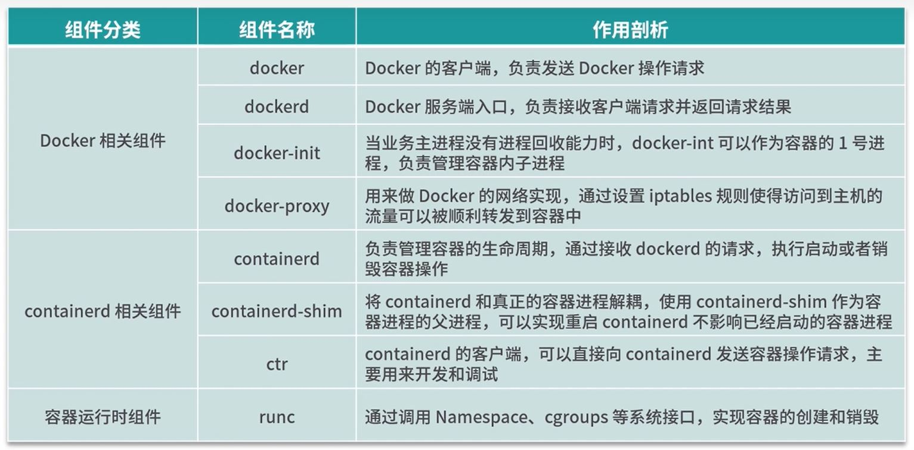
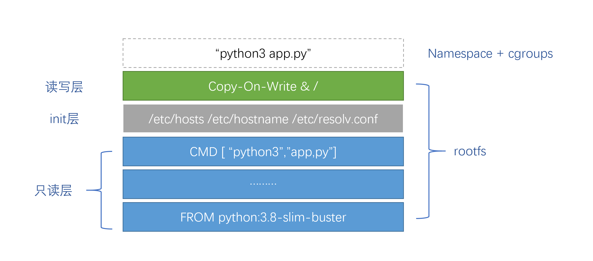

随着云原生时代的来临，云以及分布式计算已经是时下最受欢迎的技术之一了。其中 Docker 作为最知名的容器平台，到底有着怎样的魅力来让其无人不知无人不晓？废话不多说，让我们开始逐层掀开容器技术的神秘面纱吧！

# Docker 发展


让时间回到 2013 年，在该时候，虚拟机和云服务已经很流行了。主流用户的常见做法，就是在云平台（比如腾讯云、AWS、OpenStack 等），像管理物理服务器一样用脚本来做管理和部署应用。

这样的做法一直存在本地环境和线上环境不一致导致部署出现问题的风险，所以各家云平台的思路都是去模拟出更加接近本地服务器的环境，来给用户提供更好的上云体验。所以开源的 PaaS 项目提供“应用托管”的能力，就是解决该问题的一个最佳方案。

在众多开源 PaaS 项目中，最热门的 Cloud Foundry 基本上已经吸引了所有云厂商的目光，开启了以开源 PaaS 为核心构建平台层服务能力的变革。

大家可能并不是很熟悉 Cloud Foundry，简单的说，Cloud Foundry 所做的就是提供一个 “cf push” 命令行工具，让大家能够对一些主流语言的代码进行打包上传和分发。然后 Cloud Foundry 通过调用操作系统的 CGroups 和 Linux Namespace，单独为每一个应用创建一个隔离的沙盒环境，然后在其中启动这些应用的进程。

所以当时 Cloud Foundry 最核心的能力，就是提供隔离的运行环境，也就是“容器”了。

同期，有一家名叫 dotCloud 的公司，因为它的主打产品跟 Cloud Foundry 社区是脱节的，所以长期以来都无人问津。终于，dotCloud 公司决定开源自己的容器项目 Docker。

但很可惜在当时并没有人关注 dotCloud 的该决定，因为“容器”该概念从来就不是什么新鲜的东西，也不是 Docker 公司发明的。哪怕是在当时最热门的 PaaS 项目 Cloud Foundry 里，容器也只是其最底层，最没人关注的那一部分。

而 Docker 项目，实际上和 Cloud Foundry 的容器并没有太大的不同，所以在 Docker 发布后不久，Cloud Foundry 的首席产品经理 James Bayer 就在社区里做了一次详细对比，告诉用户 Docker 实际上只是一个同样使用 Cgroups 和 Namespace 实现的“沙盒”而已，没有什么特别的黑科技，也不需要特别关注。

然而，几个月后，James Bayer 就被打脸了。Docker 只用了短短几个月，就让所有 PaaS 社区都出局了。事实上，Docker 项目确实和 Cloud Foundry 的容器在大部分功能和实现原理上并没有什么区别，但仅有的一个不一样的功能，成了 Docker 项目的制胜关键。

`该功能就是 Docker 镜像。`

当时主流的 PaaS 项目，如 Cloud Foundry，都通过提供一套应用打包功能，帮助用户大规模部署到集群。但就是该打包功能，需要用户为每个应用做大量的配置工作和调试工作，才能让本地能供正确运行的应用，在集群里也能正确运行。

而 Docker 镜像，恰好解决了该根本性的问题。Docker 镜像的本质，就是一个压缩包，但和 PaaS 的应用打包相比，该压缩包里则是多了完整的运行环境依赖内容，比如操作系统的所有文件和目录。只要用户拿着该压缩包，便可以通过某些技术手段在任何地方创建一个沙盒来运行用户的应用了，因为其做到了本地环境和云端环境高度的一致，再加上 Docker 充满趣味性的推广，比如 “1 分钟部署一个 WordPress 网站”、“3 分钟部署一个 Nginx 集群”等，最终通过与开发者的亲密关系，加上解决了打包的根本性难题，从而一举登天。

# Docker 基础

## 什么是容器?

一句话概括容器：容器就是将软件打包成标准化单元，以用于开发、交付和部署。

- **容器镜像是轻量的、可执行的独立软件包** ，包含软件运行所需的所有内容：代码、运行时环境、系统工具、系统库和设置。
- **容器化软件适用于基于 Linux 和 Windows 的应用，在任何环境中都能够始终如一地运行。**
- **容器赋予了软件独立性**，使其免受外在环境差异（例如，开发和预演环境的差异）的影响，从而有助于减少团队间在相同基础设施上运行不同软件时的冲突。

## 虚拟机与容器
容器虚拟化的是操作系统而不是硬件，容器之间是共享同一套操作系统资源的。虚拟机技术是虚拟出一套硬件后，在其上运行一个完整操作系统。因此容器的隔离级别会稍低一些。

虚拟机技术：将物理服务器虚拟成多个逻辑服务器。


每个虚拟机都右完整的操作系统，之间彼此隔离。因为运行完整的操作系统，所以速度慢。


Docker不是虚拟机，但可以理解为轻量的虚拟机。Docker可以让开发者打包他们的应用以及依赖包到一个轻量级、可移植的容器中，然后发布到任何流行的Linux机器上。


- 容器是一个应用层抽象，共享操作系统内核，但各自作为独立的进程在用户空间中运行，占用空间小，启动快。
- 虚拟机 (VM) 是一个物理硬件层抽象，用于将一台服务器变成多台服务器。管理程序允许多个 VM 在一台机器上运行。每个 VM 都包含一整套操作系统、一个或多个应用、必要的二进制文件和库资源，因此占用大量空间。而且 VM启动也十分缓慢。

两者有不同的使用场景。虚拟机更擅长于彻底隔离整个运行环境。例如，云服务提供商通常采用虚拟机技术隔离不同的用户。而Docker 通常用于隔离不同的应用，例如前端，后端以及数据库。

## 什么是 Docker?

- Docker 是世界领先的软件容器平台。
- Docker使用Go 语言进行开发实现，基于Linux 内核提供的 CGroup 功能和 namespace 来实现的，以及 AUFS 类的 **UnionFS** 等技术，**对进程进行封装隔离，属于操作系统层面的虚拟化技术。** 由于隔离的进程独立于宿主和其它的隔离的进程，因此也称其为容器。
- Docker 能够自动执行重复性任务，例如搭建和配置开发环境，从而解放了开发人员。
- 用户可以方便地创建和使用容器，把自己的应用放入容器。容器还可以进行版本管理、复制、分享、修改，就像管理普通的代码一样。

容器的特点：
- **轻量** : 在一台机器上运行的多个 Docker 容器可以共享这台机器的操作系统内核；它们能够迅速启动，只需占用很少的计算和内存资源。镜像是通过文件系统层进行构造的，并共享一些公共文件。这样就能尽量降低磁盘用量，并能更快地下载镜像。
- **标准** : Docker 容器基于开放式标准，能够在所有主流 Linux 版本、Microsoft Windows 以及包括 VM、裸机服务器和云在内的任何基础设施上运行。
- **安全** : Docker 赋予应用的隔离性不仅限于彼此隔离，还独立于底层的基础设施。Docker 默认提供最强的隔离，因此应用出现问题，也只是单个容器的问题，而不会波及到整台机器。
- 一致的运行环境。
- 更快速的启动时间。
- 隔离性。
- 弹性伸缩，快速扩展。
- 迁移方便。
- 持续交付和部署。

Docker 包括三个基本概念:
- 镜像（Image）
- 容器（Container）
- 仓库（Repository）

## 镜像 Image
An image is an executable package that includes everything needed to run an application, the code, a runtime, libraries, environment variables, and configuration files.

操作系统分为内核和用户空间，对于Linux而言，内核启动后，会挂载root文件系统为其提供用户空间支持。

而Docker image就相当于是一个root文件系统，是一个特殊的文件系统，除了提供容器运行时所需的程序、库、资源、配置等文件外，还包含了一些为运行时准备的一些配置参数（如环境变量、用户等）。镜像不包含任何动态数据，其内容在构建之后也不会被改变。

利用Union FS的技术(联合文件)，将其设计为分层存储的架构。镜像构建时，会一层层构建，前一层是后一层的基础。
每一层构建完就不会再发生改变，后一层上的任何改变只发生在自己这一层。分层存储的特征还使得镜像的复用、定制变的更为容易。甚至可以用之前构建好的镜像作为基础层，然后进一步添加新的层，以定制自己所需的内容，构建新的镜像。

## 容器 Container
A container is launched by running an image, an instance of an image. What the image becomes in memory when executed (that is, an image with state, or a user process).

镜像运行时的实体。镜像（Image）和容器（Container）的关系，就像是面向对象程序设计中的类和实例一样，镜像是静态的定义，容器是镜像运行时的实体。容器可以被创建、启动、停止、删除、暂停等 。容器的实质是进程，但与直接在宿主执行的进程不同，容器进程运行于属于自己的独立的命名空间。

容器也是分层存储。容器存储层的生存周期和容器一样，容器消亡时，容器存储层也随之消亡。因此，任何保存于容器存储层的信息都会随容器删除而丢失。按照Docker最佳实践的要求，容器不应该向其存储层内写入任何数据，容器存储层要保持无状态化。所有的文件写入操作，都应该使用数据卷（Volume）来提供独立于容器之外的持久化存储。或者绑定宿主目录，在这些位置的读写会跳过容器存储层，直接对宿主(或网络存储)发生读写，其性能和稳定性更高。

容器是完全使用沙箱机制，相互之间不会有任何接口（类似iPhone的app），更重要的是容器性能开销极低。

## 仓库 Repository
集中存放镜像文件的地方。镜像构建完成后，可以很容易的在当前宿主上运行，但是如果需要在其它服务器上使用这个镜像，我们就需要一个集中的存储、分发镜像的服务，Docker Registry就是这样的服务。一个Docker Registry中可以包含多个仓库（Repository），每个仓库可以包含多个标签（Tag），每个标签对应一个镜像(版本)。我们可以通过<仓库名>:<标签>的格式来指定具体是这个软件哪个版本的镜像。如果不给出标签，将以latest作为默认标签。

最常使用的Registry公开服务是官方的Docker Hub(hub.docker.com)。

## 命令
```bash
# image:
docker search 镜像id或name：在Docker Hub（或其他镜像仓库如阿里镜像）仓库中搜索关键字的镜像
docker pull 镜像id或name：从仓库中下载镜像，若要指定版本，则要在冒号后指定
docker images 列出已经下载的镜像，查看镜像
docker rmi 镜像id或name：删除本地镜像
docker rmi -f 镜像id或name:  删除镜像
docker build 构建镜像
docker images prune # 清理临时的、没有被使用的镜像文件。-a, --all: 删除所有没有用的镜像，而不仅仅是临时文件；

# container:
docker container ls
docker container ls --all # 列出本机所有容器，包括终止运行的容器
docker container rm [containerID]
docker container run hello-world # docker container run命令会从 image 文件，生成一个正在运行的容器实例 
docker run ubuntu echo hello docker 是用一个Ubuntu镜像运行ehco hello docker命令。
docker run nginx 启动一个nginx容器。
docker run 启动container。
docker container kill [containID] # docker container kill 命令手动终止
docker ps：列出运行中的容器
docker ps -a ： 查看所有容器，包括未运行
docker stop 容器id或name：停止容器
docker kill 容器id：强制停止容器
docker start 容器id或name：启动已停止的容器
docker inspect 容器id：查看容器的所有信息
docker container logs 容器id：查看容器日志
docker top 容器id：查看容器里的进程
docker exec -it 容器id /bin/bash：进入容器
exit：退出容器
docker rm 容器id或name：删除已停止的容器
docker rm -f 容器id：删除正在运行的容器
docker exec -it 容器ID sh :进入容器

docker cp 在host和container之间拷贝文件。
docker commit 保存改动为新的image。

docker tag [imagename] [username] 给镜像打tag
docker push [imagename] 提交打registry

docker run -d 后台运行
docker exec 在运行的容器中运行命令 （-i，-t）

docker version # 查看docker版本
```

## Dockerfile 
可以用Dockerfile来创建镜像。例如：
```dockerfile
FROM ubuntu
RUN sed -i 's/archive.ubuntu.com/mirrors.ustc.edu.cn/g' /etc/apt/sources.list
RUN apt-get update
RUN apt-get install -y nginx
COPY index.html /var/www/html
ENTRYPOINT ["/usr/sbin/nginx", "-g", "daemon off;"]
EXPOSE 80
```
then build and run the image:
```bash
touch index.html
vi index.html #随便填点什么
docker build -t wrma/hello_nginx .
docker run -d -p 80:80 wrma/hello_nginx
```

The docker build command builds an image from a Dockerfile and a context. The build’s context is the set of files at a specified location PATH or URL. The PATH is a directory on your local filesystem. The URL is a Git repository location.

A context is processed recursively. So, a PATH includes any subdirectories and the URL includes the repository and its submodules.

The build is run by the Docker daemon, not by the CLI. The first thing a build process does is send the entire context (recursively) to the daemon. In most cases, it’s best to start with an empty directory as context and keep your Dockerfile in that directory. Add only the files needed for building the Dockerfile.

Here is the format of the Dockerfile:

    # Comment
    INSTRUCTION arguments

The instruction is not case-sensitive. However, convention is for them to be UPPERCASE to distinguish them from arguments more easily.

Docker runs instructions in a Dockerfile in order. A Dockerfile must start with a `FROM` instruction. The FROM instruction specifies the Base Image from which you are building.

Docker treats lines that begin with # as a comment, unless the line is a valid parser directive. A # marker anywhere else in a line is treated as an argument.

镜像分层，Dockerfile中每一行都是一个新层。

### FROM
The `FROM` instruction initializes a new build stage and sets the Base Image for subsequent instructions. As such, a valid Dockerfile must start with a FROM instruction.

### RUN 执行命令
The `RUN` instruction will execute any commands in a new layer on top of the current image and commit the results. The resulting committed image will be used for the next step in the Dockerfile.

### ADD 添加文件
ADD has two forms:

    ADD [--chown=<user>:<group>] <src>... <dest>
    ADD [--chown=<user>:<group>] ["<src>",... "<dest>"] (this form is required for paths containing whitespace)

The ADD instruction copies new files, directories or remote file URLs from `<src>` and adds them to the filesystem of the image at the path `<dest>`.

### COPY
COPY has two forms:

    COPY [--chown=<user>:<group>] <src>... <dest>
    COPY [--chown=<user>:<group>] ["<src>",... "<dest>"] (this form is required for paths containing whitespace)

The COPY instruction copies new files or directories from `<src>` and adds them to the filesystem of the container at the path `<dest>`.

这里的source是相对于Dockerfile的路径，dest目标路径是相对于镜像的路径。

### EXPOSE 暴露端口
    docker run -p 主机端口:容器端口
    docker run -P 所有端口随机映射

This port remapping of 4000:80 demonstrates the difference between EXPOSE within the Dockerfile and what the publish value is set to when running docker run -p.
In later steps, map port 4000 on the host to port 80 in the container and use http://localhost.

### Paser Directives
syntax
escape

### Environment Replacement
变量替换。declared with the `ENV` statement.

    FROM busybox
    ENV foo /bar
    WORKDIR ${foo}   # WORKDIR /bar
    ADD . $foo       # ADD . /bar
    COPY \$foo /quux # COPY $foo /quux

### .dockerignore
忽略的目录和文件，类似.gitignore文件。

### CMD
用途：CMD 用于为容器指定默认的启动命令及参数。如果用户在运行容器时没有指定新的命令，则使用 CMD 中定义的命令。

覆盖性：用户可以通过 docker run 命令行直接指定新的命令来覆盖 CMD 指定的默认命令。

语法形式：CMD 可以有三种形式：
- CMD ["executable", "param1", "param2"]（exec 形式，推荐）
- CMD command param1 param2（shell 形式）
- CMD ["param1", "param2"]（作为 ENTRYPOINT 的默认参数）

### ENTRYPOINT
用途：ENTRYPOINT 用于设置容器启动时运行的可执行文件、脚本路径，或者一个命令。与 CMD 不同，它的主要目的是为容器提供一个固定的执行命令，这个命令不容易被覆盖。

覆盖性：虽然用户在运行容器时可以通过 docker run 提供额外的参数，但这些参数会作为 ENTRYPOINT 后的参数，而不是替换 ENTRYPOINT。这意味着 ENTRYPOINT 定义的命令总是会被执行，而 CMD 定义的参数可能会被用户提供的参数覆盖。

语法形式：与 CMD 类似，ENTRYPOINT 也有 exec 形式和 shell 形式，推荐使用 exec 形式以避免不必要的 shell 进程开销。

最佳实践：CMD 与 ENTRYPOINT 的结合使用。通常，ENTRYPOINT 用来指定容器的主要应用程序或脚本，而 CMD 用来传递默认参数给 ENTRYPOINT。这样，用户既可以在不覆盖整个启动命令的情况下，通过 docker run 添加额外的参数，灵活调整容器行为。
示例：
```Dockerfile
  # 使用 ENTRYPOINT 定义执行的程序
  ENTRYPOINT ["/usr/bin/myapp"]
  
  # 使用 CMD 传递默认参数
  CMD ["--default-option"]
```
在这个例子中，如果不提供额外参数，容器将执行 /usr/bin/myapp --default-option。如果用户运行 docker run myimage --custom-param，则实际执行的命令变为 /usr/bin/myapp --custom-param，这里的 --custom-param 替换了 CMD 中的默认参数。


#### Docker entry and cmd overwritten.

When you override the default Entrypoint and Cmd, these rules apply:

1. If you do not supply command or args for a Container, the defaults defined in the Docker image are used.
2. If you supply a command but no args for a Container, only the supplied command is used. The default EntryPoint and the default Cmd defined in the Docker image are ignored.
3. If you supply only args for a Container, the default Entrypoint defined in the Docker image is run with the args that you supplied.
4. If you supply a command and args, the default Entrypoint and the default Cmd defined in the Docker image are ignored. Your command is run with your args.

Here are some examples:

|  Image Entrypoint | Image Cmd | Container command | Container args | Command run    |
| ----------------- | --------- | ----------------- | -------------- | -------------- |
|    [/ep-1]        | [foo bar] | not set           | not set        | [ep-1 foo bar] |
|    [/ep-1]        | [foo bar] | [/ep-2]           | not set        | [ep-2]         |
|    [/ep-1]        | [foo bar] | not set           | [zoo boo]      | [ep-1 zoo boo] |
|    [/ep-1]        | [foo bar] | [/ep-2]           | [zoo boo]      | [ep-2 zoo boo] |

## Multi stage build
例如：
```dockerfile
# Stage 1:

# Start from the golang alpine as base image
FROM golang:1.11-alpine as builder

# Set the Working Directory inside the container
WORKDIR /go/src/app

# Copy the source from the current directory to the Working Directory inside the container
COPY . .

# Build the app my-app
RUN go build

# enter point to the program
# ENTRYPOINT ["/go/src/my-app/my-app"]
# CMD []

# Stage 2:

# Start from alpine system as base image:
FROM alpine:latest

# Add Maintainer Info
LABEL maintainer="Wenran Ma <mawenran@gmail.com>"

# Set the Working Directory inside the container
WORKDIR /root

# Copy binary from previous stage to working dir
COPY --from=builder /go/src/app ./

# Set permission, no need actually
# RUN chmod +x /root/my-app/my-app

# Entry point
ENTRYPOINT ["/root/app"]

# For pass arguments, only for test.
CMD []
```

## dockerfile原则
- 单一职责
- 注释
- 保持容器最小化
- 合理选择基础镜像
- dockerignore
- 尽量使用构建缓存
    - 不轻易改变的放在dockerfile前面，比如环境遍历，安装依赖。增加缓存命中概率
- 正确设置时区
- 最小化镜像层数
    - 比如 RUN yum install -y a b c, 而不是三条RUN命令


# Docker架构
## Client-Server
Docker是client server模式。Docker Daemon (dockerd) 是服务端的守护进程，负责管理Docker的各种资源。各种docker命令都是通过docker客户端发送给docker daemon，处理后再返回给docker client。


## 组件


### docker-init
docker-init 是一个初始化系统，通常用于在容器内部启动进程，特别是为了管理和协调容器内的多个子进程。
当一个容器需要运行多个进程（比如，一个主应用和一些辅助服务）时，docker-init 可以作为PID 1（父进程）运行，提供信号转发和进程管理功能。
PID 1 在Unix系统中具有特殊的角色，它负责处理子进程的退出并决定容器是否应该退出。docker-init 确保了容器内进程的正常生命周期管理，防止僵尸进程（zombie processes）和孤儿进程（orphan processes）。

### docker-proxy
docker-proxy 是一个小型的网络代理，用于处理端口映射。
当你通过 -p 或 --publish 参数将容器的端口映射到主机的端口时，docker-proxy 会在主机上启动，并监听指定的主机端口。
它的主要作用是将主机接收到的网络流量转发给容器内的相应端口，这样外部就可以通过主机IP和指定端口与容器内的服务通信。

### containerd
containerd 是一个业界标准的容器运行时，它提供了完整的容器生命周期管理功能，包括镜像管理、容器执行、存储和网络管理等。它是 Docker 以及其他容器平台背后的关键组件，旨在作为一个更加底层、更为精简的服务，与操作系统紧密集成，为更高层次的系统如 Kubernetes 提供容器管理服务。相较于 Docker 守护进程，containerd 的调用链更短，组件更少，从而提高了效率和稳定性。

### containerd-shim
containerd-shim 是 containerd 架构中的一个轻量级进程，作为 containerd 和实际容器运行时（如 runc）之间的桥梁。它的主要职责是隔离容器的运行环境，以及管理容器的生命周期，包括启动、停止、重启等操作。Shim 进程确保了当 containerd 创建或管理容器时，能够以安全且资源受限的方式执行 runc 命令。每个容器通常对应一个 shim 进程，这有助于提高系统的稳定性和安全性，因为即使 containerd 重启，容器仍能继续运行。

### ctr
ctr 是 containerd 自带的一个命令行工具，用于直接与 containerd 交互，执行低级别的容器和镜像管理任务。ctr 对于调试 containerd 相关问题、执行容器的底层管理操作非常有用。

### runc
runc 是一个开放源代码的命令行工具，用于创建和运行容器以及容器生命周期管理：runc 能够创建、启动、停止、重启以及删除容器。它管理容器的整个生命周期，包括处理网络命名空间、用户权限、文件系统隔离等容器运行所需的资源隔离。它是轻量级的容器运行时。runc 支持在多种 Linux 环境下运行容器，并且是 Docker、containerd 以及其他容器管理系统中的核心组件之一。

### libnetwork
Libnetwork 是 Docker 项目中负责管理和实现容器网络功能的一个组件，它从 Docker 1.7 版本开始被引入并逐步发展成为一个独立的库。Libnetwork 的主要目标是定义一个健壮的容器网络模型（Container Network Model, CNM），提供一个一致的编程接口和应用程序的网络抽象，使得开发者能够更容易地在 Docker 容器之间建立和管理网络连接。（cnm没有成为标准，被k8s cni代替）

CNM 模型引入了几个核心概念来简化网络配置和管理：

- Network: 表示一个逻辑网络，可以包含多个容器。网络定义了容器间如何通信的策略。
- Endpoint: 代表容器在网络中的一个连接点。每个容器可以有一个或多个端点，连接到不同的网络。
- Sandbox: 为每个容器创建的网络命名空间，包含容器的网络配置，如 IP 地址、路由表等。沙箱确保了容器间网络的隔离。
- Driver: 网络驱动程序，如 bridge、overlay、macvlan 等，它们实现了具体的网络连接逻辑，使得 Libnetwork 可以支持多种网络后端。

Libnetwork 支持多种网络模式以适应不同的容器网络配置需求：

- Bridge模式: 这是最常用的网络模式，Docker安装后默认创建一个名为docker0的网桥。容器启动时，如果不特别指定网络，就会自动连接到这个网桥上。容器之间以及容器与宿主机可以通过网桥进行通信，但对外部网络来说，容器看起来像是宿主机上的一个单独的主机。

- Host模式: 在这种模式下，容器直接使用宿主机的网络栈，容器的网络配置与宿主机完全相同，容器的网络接口直接绑定到宿主机的网络接口上。这意味着容器可以访问宿主机的网络设备和端口，对性能敏感的应用可能会选择此模式。

- None模式: 容器有网络 namespace，但是并不赋予任何网络配置，即没有网络连接。这适用于不需要网络访问的容器，或者你计划手动配置网络的场景。

- Overlay模式: 该模式用于在多个宿主机间创建容器网络，实现跨主机容器通信。它使用VXLAN等网络隧道技术，在宿主机间建立一个覆盖网络。每个容器都被分配一个在全局范围内唯一的虚拟IP地址，无论容器运行在哪台宿主机上，都可以通过这个IP与其他容器通信。

- Container模式：在这种模式下，一个容器会连接到另一个容器的网络命名空间，共享其网络配置。这意味着第一个容器（被连接的容器）的网络接口、IP地址和路由信息会被第二个容器（连接到的容器）继承。这种模式通常用于测试或调试目的，因为它允许一个容器直接访问另一个容器的网络资源，而不必通过宿主机或额外的网络配置。


# 高级

Docker 技术是基于 LXC（Linux container- Linux 容器）虚拟容器技术的。

LXC，其名称来自 Linux 软件容器（Linux Containers）的缩写，一种操作系统层虚拟化（Operating system–level virtualization）技术，为 Linux 内核容器功能的一个用户空间接口。它将应用软件系统打包成一个软件容器（Container），内含应用软件本身的代码，以及所需要的操作系统核心和库。通过统一的名字空间和共用 API 来分配不同软件容器的可用硬件资源，创造出应用程序的独立沙箱运行环境，使得 Linux 用户可以容易的创建和管理系统或应用容器。

LXC 技术主要是借助 Linux 内核中提供的 CGroup 功能和 namespace 来实现的，通过 LXC 可以为软件提供一个独立的操作系统运行环境。

一个“容器”，实际上是一个由 Linux Namespace、Linux Cgroups 和 rootfs 三种技术构建出来的进程的隔离环境。

- Linux Namespace 和 Linux Cgroups，提供了运行时的隔离和资源的管理。
- rootfs，也就是镜像，提供了容器的运行内容。

比如对于如下 Dockerfile：

```dockerfile
# 使用官方提供的 Python 开发镜像作为基础镜像
FROM python:3.8-slim-buster

# 将工作目录切换为 /app
WORKDIR /app

# 拷贝应用依赖描述文件到工作目录
COPY requirements.txt requirements.txt

# 使用 pip 命令安装应用以及其所需的依赖
RUN pip3 install -r requirements.txt

# 拷贝应用文件到工作目录
COPY . .

# 设置容器进程为 "python3 app.py"，也是该 Python 应用的启动命令
CMD [ "python3", "app.py"]
```

在该 Dockerfile 里，我们先通过一个基础镜像 python:3.8-slim-buster，安装依赖并复制应用到工作目录，最后指定应用的进程，即启动命令。在该描述下，我们会得到如下容器视图：



该容器的进程是"python3 app.py"，运行在由 Linux namespace + Linux cgroups 构成的隔离环境里。而它所需要的各种文件，包括 Python、app.py 和整个操作系统文件，则由多个联合挂载在一起的 rootfs 提供。该 rootfs 的最下层，是只读的 Docker 镜像。在 Docker 镜像之上，是 Docker 的管理器添加的 init 层，用于临时存放被管理器修改过的 /etc/hosts 等文件。在 rootfs 的最上层是读写层，以 Copy-On-Write 的方式存放所有对只读层文件的修改，和容器声明的 Volume 挂载点。从该容器视图里，我们可以总结出一个运行中的 Linux 容器，由以下内容构成：

- 一组联合挂载的 rootfs，这部分我们称之为容器的"镜像"（Image）。
- 一个由 Linux namespace + Linux cgouprs 构成的隔离环境，这部分我们称之为容器的“运行时”（Runtime）。

## Namespace
chroot是linux下的一个命令，用于改变进程的根目录，从而改变进程的目录结构，从而改变进程的权限。改变后的进程，不能访问当前目录以外的目录和文件。（隔离的雏形）

Linux namespaces 是一种操作系统级别的隔离技术，它允许在单个操作系统实例中创建多个独立的运行环境。每个namespace都对系统资源（如进程ID、网络设备、文件系统挂载点等）进行了隔离，使得在不同namespace中的进程看到的是各自独立的视图。这为实现轻量级虚拟化、容器化技术（如Docker）提供了基础。主要的Linux namespaces类型包括：

- PID Namespace（进程ID命名空间）: 允许每个namespace有自己独立的进程ID空间，即在namespace内部可以有自己的进程ID 1。
- NET Namespace（网络命名空间）: 提供独立的网络设备、IP地址、端口范围、路由表等，使得namespace内的网络配置互不影响。
- IPC Namespace（Inter process 进程间通信命名空间）: 隔离System V IPC、POSIX消息队列等IPC机制，确保namespace之间的进程不能直接通信。
- UTS Namespace（UNIX时间共享命名空间）: 允许每个namespace拥有独立的主机名和域名，这对于容器伪装成独立的系统特别有用。
- MNT Namespace（文件系统挂载命名空间）: 提供独立的文件系统层次结构，允许在namespace内进行文件系统的挂载和卸载操作，而不影响其他namespace。
- USER Namespace（用户和组ID命名空间）: 允许映射用户和组ID，使得namespace内的root用户与宿主机上的root用户分离，增强安全性。

启动容器时自动创建 Namespace: 当使用 docker run 命令启动一个新的容器时，Docker 会通过 clone() 系统调用并设置如 CLONE_NEWPID、CLONE_NEWNET 等标志来创建以上六种新的 Namespace。这意味着每个容器都会有自己的进程、网络、IPC、UTS、用户以及文件系统挂载命名空间。

## Cgroups
Cgroups (Control Groups) 是 Linux 内核的一个功能，用于限制、记录和隔离进程组使用的物理资源（如 CPU、内存、磁盘 I/O 和网络）。它是实现容器技术和资源管理的关键组件之一，广泛应用于 Docker、Kubernetes 等容器化平台。Cgroups 的核心特性包括：

资源限制 (Resource Limitation): 允许为进程组设定资源使用上限，例如限制一个容器或一组进程最多能使用多少CPU时间或内存。

优先级分配 (Priority Allocation): 可以设置进程组访问CPU或磁盘I/O的优先级，确保关键服务或任务得到足够的资源。

资源统计 (Accounting): 记录进程组使用的资源量，帮助进行计费、审计或性能分析。

任务控制 (Control): 控制进程的行为，比如当达到资源使用阈值时，可以冻结或终止进程。

Docker 使用 cgroups (Control Groups) 来实现对容器资源使用的限制、监控和管理。以下是 Docker 利用 cgroups 的几个关键方面：

自动创建 cgroups 层次结构: 当 Docker 创建一个新的容器时，它会在 cgroups 中为该容器创建一个或多个条目，每个条目对应一个资源控制子系统（如 cpu, memory, blkio 等）。这些条目通常位于 /sys/fs/cgroup/ 目录下，并且与容器的 ID 关联，形成清晰的资源控制层次。

资源限制设置: 用户可以通过 docker run 命令的选项来设置资源限制，例如 -m 限制内存使用量，--cpus 限制CPU使用份额，Docker 会将这些限制转化为相应的 cgroups 配置。

例如：cpu.cfs_quota_us/cpu.cfs_period_us是指：每cpu.cfs_period_us(默认值100ms=100000us)至多可以使用cpu.cfs_quota_us设置的时间，以此配置CPU带宽使用的占比哈。

例如，docker run -it --memory="200m" ubuntu bash 将创建一个内存限制为200MB的Ubuntu容器。会在 /sys/fs/cgroup/memory/docker/ 目录下创建一个名为 container id的文件夹，里面是内存限制为200MB的文件。

### 监控：

docker stats

cAdvisor 定期读取主机上的资源文件，比如cpu使用，可以读取/sys/fs/cgroup/cpu/docker/<container_id>/xxx

/*
子系统，控制组，层级树

Cgroups 主要有以下几个子系统，分别针对不同的资源管理：

cpu, cpuacct: 限制、记录CPU使用时间和分配CPU份额。
memory: 限制和记录内存使用，支持内存交换和内存用量软硬限制。
blkio: 控制块设备I/O，如磁盘读写速度。
cpuset: 为进程分配特定的CPU核心和内存节点。
devices: 控制对设备文件的访问权限。
net_cls, net_prio: 标记网络流量以便进行优先级控制。
hugetlb: 管理大页内存的分配。
通过Cgroups，系统管理员和容器运行时可以细粒度地管理资源，确保不同服务或用户之间的资源公平分配，提升整体系统的稳定性和效率。
*/

## 联合文件系统 联合挂载技术
Docker 使用联合文件系统（Union File System, UnionFS）来实现其镜像的分层存储结构。这种技术允许在多个文件系统层次中对文件和目录进行透明地重叠，从而实现高效的空间利用和快速的构建过程。以下是关于 Docker 中联合文件系统的关键点：

分层存储架构：Docker 镜像由一系列只读层组成，最底层是基础镜像层，往上每一层代表一次对镜像的修改。顶层通常是可读写层，用于保存容器运行时的变动。

OverlayFS：自 Linux 内核 3.18 版本起，OverlayFS 成为了内核的一部分，并且是 Docker 推荐和广泛使用的联合文件系统之一。它是 UnionFS 的一个改进版本，优化了性能和资源使用效率。

其他联合文件系统：除了 OverlayFS，Docker 还支持或曾经支持过其他联合文件系统，包括 AUFS (Another UnionFS)、Btrfs、VFS (Virtual File System)、ZFS 和 Device Mapper。不同的系统可能会根据内核版本和配置选择不同的默认联合文件系统。

空间共享与复用：通过分层，相同的底层文件可以在多个容器间共享，而不需要为每个容器复制全部基础文件，大大节省了磁盘空间。

写时复制(CoW, Copy-on-Write)：当容器需要修改一个只读层中的文件时，该文件会被复制到可写层中进行修改，这一机制确保了底层镜像的不可变性。

存储位置：在 Linux 系统上，Docker 的数据通常存储在 /var/lib/docker 目录下，其中就包括了镜像和容器的文件系统层。

性能与灵活性：联合文件系统的设计使得 Docker 镜像的构建、部署和更新变得非常快速和灵活，同时也便于镜像的分发和版本控制。

综上所述，Docker 的联合文件系统是其实现轻量级、高效容器化技术的核心组件之一，对于理解 Docker 的工作原理至关重要。

Overlay2 
1. 所有目录称之为层 layer.
2. 把多个层展示到同一目录下的过程的叫联合挂载
3. 把目录的下一层叫lowerdir, 上一层叫upperdir, 联合挂载的结果叫merged

## Docker Volume
Docker Volume 是 Docker 提供的一种将数据持久化和管理数据卷的方法，它独立于容器的生命周期，使得数据可以在容器之间共享和持久存储。Docker Volume 主要有以下特点和用途：

数据持久化：容器内的数据通常随着容器的删除而丢失，但通过使用 Docker Volume，数据可以存储在宿主机的文件系统上，即使容器被删除，数据依然保留。

容器间共享：多个容器可以挂载同一个 Volume，实现数据共享，这对于微服务架构中的数据库存储、配置文件共享等场景非常有用。

管理便捷：Docker 提供了命令行工具来创建、列出、检查和删除 Volume，便于数据卷的管理和维护。

类型多样：Docker Volume 支持多种存储驱动，如本地存储 (local)、网络存储（如 NFS）或其他第三方存储解决方案，可以根据需要选择合适的存储类型。

迁移方便：Volume 的使用使得应用容器在不同宿主机间迁移时，只需重新挂载相同的 Volume 即可，无需迁移数据本身。

安全隔离：每个 Volume 都有独立的文件系统，确保了容器间数据的隔离性。

使用 Docker Volume 的基本命令包括：

- 创建 Volume：docker volume create [volume_name]
- 查看 Volume 列表：docker volume ls
- 检查 Volume 详情：docker volume inspect [volume_name]
- 挂载 Volume 到容器：在 docker run 命令中使用 -v 或 --volume 参数，例如 docker run -v my-vol:/path/in/container my_image
- 删除 Volume：docker volume rm [volume_name]

通过这些特性，Docker Volume 成为了在 Docker 容器中管理持久化数据的重要工具

volume在 `var/lib/docker/volumes/` 目录下，会有一个_data目录。比如mount一个volume到容器的/data目录，那么容器中的/data目录就是volume的挂载点，容器中的/data目录下的文件就会出现在 var/lib/docker/volumes/目录下的volume_name/_data目录下。

## Docker 安全

Docker 安全问题主要涉及以下几个方面，这些风险需要通过良好的管理和最佳实践来缓解：

版本漏洞: Docker 引擎及其依赖组件可能存在已知的安全漏洞。定期更新 Docker 引擎、运行时和相关软件到最新版本是至关重要的。

容器逃逸: 攻击者可能利用容器的漏洞获取宿主机的访问权限，或逃逸到其他容器中。加强命名空间和控制组的隔离机制，以及限制容器的权限，可以减少此类风险。

不安全的镜像: 使用未经验证或来源不明的 Docker 镜像可能导致恶意代码注入。始终从可信源拉取镜像，并考虑使用内容信任功能（如 Docker Content Trust）来验证镜像的完整性。

过度权限: 默认情况下，许多容器以 root 用户身份运行，增加了潜在的损害范围。应尽量使用非 root 用户运行容器，并限制容器内的权限。

网络暴露: 不恰当的网络配置可能导致敏感服务暴露给外部网络。正确配置网络策略，限制容器间的网络访问，并使用防火墙规则保护容器。

存储卷泄露: 如果容器挂载宿主机的敏感目录，可能会导致数据泄露。应谨慎管理卷挂载，确保容器只能访问必要的资源。

配置错误: 错误的 Dockerfile 指令或运行时参数可能导致安全配置不当。遵循最小权限原则，审查 Dockerfile 和运行命令，确保无多余或危险的配置。

资源滥用: 缺乏资源限制（如 CPU、内存）可能导致容器耗尽系统资源，影响其他服务。使用 cgroups 有效限制容器资源使用。

为了应对这些安全挑战，可以采取以下一些最佳实践：

定期扫描和修复镜像漏洞。
使用安全的镜像来源和验证机制。
限制容器的系统调用能力，例如使用 seccomp (Secure Computing Mode) 配置。
应用最小权限原则，包括使用非 root 用户运行容器。
实施网络策略和防火墙规则。
监控容器活动和审计日志，及时发现异常行为。
使用 Docker 的安全特性，如用户命名空间、SELinux 或 AppArmor。
定期更新和打补丁，包括底层操作系统、Docker 引擎和运行时。

# Docker 安装

前文已经介绍了容器的本质和其背后的逻辑，我们现在以 `Ubuntu 18 LTS` 为例，介绍如何安装 Docker。

### 配置 REPOSITORY

1、更新 `apt` 包管理器索引和配置 `apt` 能够使用 HTTPS 的仓库。

```bash
sudo apt-get update

sudo apt-get install \
   apt-transport-https \
   ca-certificates \
   curl \
   gnupg \
   lsb-release
```

2、添加 Docker 官方 GPG 公钥。

```bash
curl -fsSL https://download.docker.com/linux/ubuntu/gpg | sudo gpg --dearmor -o /usr/share/keyrings/docker-archive-keyring.gpg
```

3、指定使用稳定版的 Docker 版本。

```bash
echo \
  "deb [arch=amd64 signed-by=/usr/share/keyrings/docker-archive-keyring.gpg] https://download.docker.com/linux/ubuntu \
  $(lsb_release -cs) stable" | sudo tee /etc/apt/sources.list.d/docker.list > /dev/null
```

### 安装 Docker engine

1、更新 `apt`包管理器索引，然后安装最新的稳定版 Docker engine。

```bash
sudo apt-get update

sudo apt-get install docker-ce docker-ce-cli containerd.io
```

2、安装完成后，通过执行 `hello-world`镜像，验证 Docker engine。

```bash
sudo docker run hello-world
```

# DevOps
## Docker compose
Compose is a tool for defining and running multi-container Docker applications. With Compose, you use a YAML file to configure your application’s services. Then, with a single command, you create and start all the services from your configuration.

## 蓝绿发布
（Blue-Green Deployment）是一种零停机时间的软件部署策略，旨在减少新版本上线时对用户体验的影响并确保服务的连续性。蓝绿发布的基本思想是在生产环境中同时维护两个相同的基础设施环境，通常标记为“蓝色”（Blue）和“绿色”（Green）：
- 蓝色环境（Blue）：代表当前正在为用户提供服务的生产环境，运行着旧版本的应用程序。
- 绿色环境（Green）：代表待部署的新版本环境，最初没有用户流量，用于部署和测试新版本的应用程序。

蓝绿发布的流程大致如下：

- 部署新版本：在绿色环境中部署新版本的应用程序，此时蓝色环境继续为所有用户服务，新版本不接收任何用户流量。
- 验证新版本：在绿色环境中进行全面的健康检查和功能验证，确保新版本无误。这一步可能包括引入一小部分真实用户流量进行测试（金丝雀发布）。
- 切换流量：一旦确认新版本无误，通过更新负载均衡器或DNS配置，将用户流量无缝切换到绿色环境。此时，所有用户都将访问新版本的应用程序。
- 回滚准备：如果新版本在生产中遇到问题，可以通过快速切换回蓝色环境来实现即时回滚，保证服务的稳定性。
- 清理和准备：如果新版本成功上线，蓝色环境可以用来准备下一次部署的新版本，或者作为紧急情况下的备用环境，然后关闭或更新为下一个“绿色”环境。

蓝绿发布的优势在于可以立即回滚到已知良好的状态，同时保证了部署过程的平滑和风险最小化，非常适合要求高可用性的在线服务

