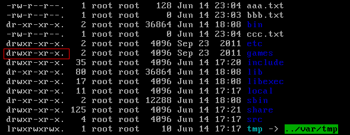

## Linux 软件安装
### RPM 安装
    有两种安装包：
    1. 最初的Linux是通过源码包安装的。编译时间长，容易报错。
    （LAMP Linux, Apache, MySQL, PHP网站开发套件。）

    2. 后来出现了二进制包，也就是RPM包，不能看到源码，但安装比源码安装简单。
    再后来出现了yum工具安装以解决RPM包安装的依赖问题。

    RPM安装命令：
    rpm -ivh 软件包全名。
    -i install 安装。
    -v verbose 显示详细信息。
    -h hash 显示进度。

    升级命令：
    rpm -Uvh 包全名。-U update。

    卸载命令：
    rpm -e 包名。-e erase。这里不需要包全名，只要包名（包全名的英文部分）就可以。

    查询命令：
    rpm -q 包名。查询某个包。
    rpm -qa 查询全部安装的包。rpm -qa | grep httpd
    rpm -ql 包名。查询包中各种文件的安装位置。也可以查询未安装的包准备装在哪。
    rpm -qf 系统文件名。查询该文件属于哪个包。

    校验命令：
    rpm -V 包名。查看包中文件是否会更改。

### yum 在线安装
    /etc/yum.repos.d/目录中存在.repo文件。
    repo文件的内容：
    [name]:     容器名称，如[base],[update]。
    name:       容器说明。
    mirrorlist: 镜像站点。
    baseurl:    yum源服务器地址。
    enabled:    容器是否生效，默认生效。
    gpgcheck:   如果是1，RPM数字证书生效。
    gpgkey:     数字证书的公钥保存位置。

    查询命令：
    yum list
    yum search 关键字

    安装命令：
    yum -y install 包名，-y 自动回答yes，而且不需要包全名，包名就可以。

    升级命令：
    yum -y update 包名。如果不写包名，则会升级所有。

    卸载：
    yum -y remove 包名。不建议使用，服务器使用最小化安装，用什么装什么，尽量不卸载。

    yum还支持组安装：
    yum grouplist, yum groupinstall, yum groupremove。

### 源码安装
    make 编译。
    make clear 如果错误，可以清楚已经编译的输出文件。
    make install，安装命令。

    如果删除，则直接删除安装目录。

---

## Linux 服务管理
### 1. 介绍
#### 系统运行级别：
    0. 关机
    1. 单用户模式，主要用于系统修复
    2. 不完全命令模式，不含NFS服务
    3. 完全命令模式，就是标准字符界面
    4. 系统保留
    5. 图形模式
    6. 重启

    runlevel 显示运行级别。
    init 级别号 改变运行级别。

#### 查询服务
    chkconfig --list
    可以看到RPM包安装的服务。会显示服务的自启动状态。

    源码包安装的服务一般在/usr/local/下。

#### 独立服务启动
    RPM包安装的服务会在/etc/init.d/目录下有启动脚本。
    可以通过/etc/init.d/服务名 start|stop|status|restart 来操作。

    也可以通过service命令，（service是redhat系列才有service命令）
    service 服务名 start|stop|status|restart。
    不可以启动源码包安装服务。

#### 独立服务自启动
    chkcofig [--level 运行级别] 服务名 [on|off]
    表示设定运行级别。但是服务的启动状态为不确定，下次开机后自启动。
    比如 chkconfig --level 2345 httpd on
    chkconfig httpd off 关闭自启动。

    可以修改/etc/rc.d/rc.local文件。可以将服务的启动命令放在改文件中。

---

## Linux 权限管理
    服务器应当合理分配权限，一般只有一个管理员，其他人为普通用户。

### 1. 基本权限
    权限位：-rw-r--r-- ,一共10位，第一位为文件类型（- 文件，d 目录，l 软链接）。
    后面每三位为一组，第一组代表所有者u，第二组为所属组g，第三组为其他人o。
    r读，w写，x执行。

#### 基本权限修改 chmod 命令：
    chmod [选项] 模式 文件名

    例如：
    chmod u+x readme.md 给readme.md的所有者u加可执行权限。
    chmod g+w,o+w readme.md 给readme.md的所属组g和其他人o加写权限。
    chmod u-w,g-w,o-w readme.md 去掉readme.md的写权限。
    chmod u=rwx,g=rw readme.md 另一种方式，直接复制。
    chomd a=rwx readme.md a代表所有人。

    用数字代表权限（二进制位）：r -- 4, w -- 2, x -- 1. rwxr-xr-x即755。
    chmod 755 readme.md, 777为最高权限，644读写权限，755可执行权限，这几个比较常用。

#### 权限的作用

    r: 读取文件内容（cat, more, head, tail），可以查看目录下文件名（ls）。
    w: 对文件编辑，新增，修改文件内容（vi, echo），但不包括删除文件。写权限是指对下一级的操作，例如要有对目录的写权限，才可以删除目录下的文件。对目录可新曾，删除，剪切文件和子目录等（touch, rm, mv, cp）。
    x: 对文件的执行权限。对目录可以进入（cd）。

    对文件的最高权限是执行x，对目录的最高权限是写w。对目录可以赋的权限只有0，5，7，其他（1，4，6）没有意义。

#### chown 命令
    修改文件所有者 chown user 文件名。
    chown user:group 文件名可以一次修改所有者和所属组。

#### chgrp 命令
    修改文件所属组 chgrp 组名 文件名
    Linux会在添加用户时，会默认增加和用户名相同的组名。

#### 文件默认权限 umask
    umask 命令，结果022。可以修改mask值。

    文件默认不能建立可执行文件，必须手动赋予，所以文件默认权限最大为666，默认权限和umask换算成字母后相减得到最后权限。
    文件最大权限666（-rw-rw-rw-），umask为022（-----w--w-），再相减为 -rw-r--r--。

    目录的默认权限为777（drwxrwxrwx），umask为022（-----w--w-），换算后相减为755（drwxr-xr-x)。

### 2. 特殊权限
#### sudo 权限
    root把超级用户执行的命令赋予普通用户。sudo的操作对象是系统命令！

    visudo超级用户赋予权限的命令。visudo会打开/etc/sudoers文件，可以赋予普通用户命令。
    例如：visudo 然后键入 user1 ALL=/sbin/shutdown -r now。保存退出。
    
    su命令可以切换用户。
    然后用普通用户，sudo -l可以拆看可以执行的命令（被赋予的）。
    普通用户输入的命令前都要加sudo。


#### su
su命令的主要作用是让你可以在已登录的会话中切换到另外一个用户。这个工具可以让你在不登出当前用户的情况下登录为另外一个用户。

su命令经常被用于切换到超级用户或root用户（因为在命令行下工作，经常需要root权限），su命令也可以用于切换到任意非 root用户。

su命令要求输入的密码是root用户的密码。所以，一般 su 命令需要输入目标用户的密码。在输入正确的密码之后，su 命令会在终端的当前会话中打开一个子会话。

su -
还有一种方法可以切换到 root 用户：运行 su - 命令，如下：

那么，su 命令与 su - 命令之间有什么区别呢？前者在切换到 root 用户之后仍然保持旧的（或者说原始用户的）环境，而后者则是创建一个新的环境（由 root 用户 ~/.bashrc 文件所设置的环境），相当于使用 root 用户正常登录（从登录屏幕登录）。

su 命令手册页很清楚地说明了这一点：

可选参数 - 可提供的环境为用户在直接登录时的环境。

因此，你会觉得使用 su - 登录更有意义。但是， su 命令也是有用的，关于 su 命令的好处和坏处：

有的时候，对于系统管理员（root）来讲，使用其他普通用户的 Shell 账户而不是自己的 root Shell 账户更会好一些。尤其是在处理用户问题时，最有效的方法就是是：登录目标用户以便重现以及调试问题。
然而，在多数情况下，当从普通用户切换到 root 用户进行操作时，如果还使用普通用户的环境变量的话，那是不可取甚至是危险的操作。因为是在无意间切换使用普通用户的环境，所以当使用 root 用户进行程序安装或系统更改时，会产生与正常使用 root 用户进行操作时不相符的结果。例如，以普通用户安装程序会给普通用户意外损坏系统或获取对某些数据的未授权访问的能力。
注意：如果你想在 su - 命令的 - 后面传递更多的参数，那么你必须使用 su -l 而不是 su -。以下是 - 和 -l 命令行选项的说明：

-, -l, --login

提供相当于用户在直接登录时所期望的环境。

当使用 - 时，必须放在 su 命令的最后一个选项。其他选项（-l 和 --login）无此限制。

su -c
还有一个值得一提的 su 命令行选项为：-c。该选项允许你提供在切换到目标用户之后要运行的命令。

su 命令手册页是这样说明：

-c, --command COMMAND

使用 -c 选项指定由 Shell 调用的命令。

被执行的命令无法控制终端。所以，此选项不能用于执行需要控制 TTY 的交互式程序。

参考示例：

su [target-user] -c [command-to-run]
示例中，command-to-run 将会被这样执行：

[shell] -c [command-to-run]
示例中的 shell 类型将会被目标用户在 /etc/passwd 文件中定义的登录 shell 类型所替代。

sudo vs. su
现在，我们已经讨论了关于 su 命令的基础知识，是时候来探讨一下 sudo 和 su 命令之间的区别了。

关于密码
两个命令的最大区别是：sudo 命令需要输入当前用户的密码，su 命令需要输入 root 用户的密码。

很明显，就安全而言，sudo 命令更好。例如，考虑到需要 root 访问权限的多用户使用的计算机。在这种情况下，使用 su 意味着需要与其他用户共享 root 用户密码，这显然不是一种好习惯。

此外，如果要撤销特定用户的超级用户/root 用户的访问权限，唯一的办法就是更改 root 密码，然后再告知所有其他用户新的 root 密码。

而使用 sudo 命令就不一样了，你可以很好的处理以上的两种情况。鉴于 sudo 命令要求输入的是其他用户自己的密码，所以，不需要共享 root 密码。同时，想要阻止特定用户访问 root 权限，只需要调整 sudoers 文件中的相应配置即可。

默认行为
两个命令之间的另外一个区别是其默认行为。sudo 命令只允许使用提升的权限运行单个命令，而 su 命令会启动一个新的 shell，同时允许使用 root 权限运行尽可能多的命令，直到明确退出登录。

因此，su 命令的默认行为是有风险的，因为用户很有可能会忘记他们正在以 root 用户身份进行工作，于是，无意中做出了一些不可恢复的更改（例如：对错误的目录运行 rm -rf 命令！）。关于为什么不鼓励以 root 用户身份进行工作的详细内容，请参考这里。

日志记录
尽管 sudo 命令是以目标用户（默认情况下是 root 用户）的身份执行命令，但是它们会使用 sudoer 所配置的用户名来记录是谁执行命令。而 su 命令是无法直接跟踪记录用户切换到 root 用户之后执行了什么操作。

灵活性
sudo 命令比 su 命令灵活很多，因为你甚至可以限制 sudo 用户可以访问哪些命令。换句话说，用户通过 sudo 命令只能访问他们工作需要的命令。而 su 命令让用户有权限做任何事情。

sudo su
大概是因为使用 su 命令或直接以 root 用户身份登录有风险，所以，一些 Linux 发行版（如 Ubuntu）默认禁用 root 用户帐户。鼓励用户在需要 root 权限时使用 sudo 命令。

然而，您还是可以成功执行 su 命令，而不用输入 root 用户的密码。运行以下命令：

sudo su
由于你使用 sudo 运行命令，你只需要输入当前用户的密码。所以，一旦完成操作，su 命令将会以 root 用户身份运行，这意味着它不会再要求输入任何密码。

PS：如果你想在系统中启用 root 用户帐户（强烈反对，因为你可以使用 sudo 命令或 sudo su 命令），你必须手动设置 root 用户密码，可以使用以下命令：

sudo passwd root
结论
当你需要可用的工具来提升（或一组完全不同的）权限来执行任务时，这篇文章以及之前的教程（其中侧重于 sudo 命令）应该能给你一个比较好的建议。 如果您也想分享关于 su 或 sudo 的相关内容或者经验，欢迎您在下方进行评论。


---

## Linux 系统管理
### 1. 进程管理
    进程是一个正在运行的程序或者命令，有自己的地址空间，占用系统资源。
    进程管理主要是：判断服务器健康状态，查看系统中所有进程，杀死进程。

#### 进程查看命令 ps
    ps aux 查看系统所有进程，BSD操作系统格式。
    ps -le 查看系统所有进程，Linux标准命令格式。(常用ps -ef|grep "xxx")

    ps命令输出：
    USER: 哪个用户产生。
    PID: 进程ID。
    CPU: CPU占比。
    MEM: 物理内存百分比。
    VSZ: 虚拟内存大小，KB。
    RSS: 物理内存大小，KB。
    TTY: 终端，tty1-tty6为本地字符终端，tty7为本地图形终端，pts/0 - xxx是远程终端。如果是？基本为系统进程。
    TIME: 占用CPU时间。
    CMD: 进程名字。

    pstree, 显示进程树。

#### top命令
    top [选项] 每三秒钟刷新一次，默认按CPU占用率排序，可以用上面的几行查看进程是否健康。

    选项：
    -d 秒数，指定每隔几秒更新，默认3秒。
    -b 使用批处理输出，一般和-n合用。
    -n 次数，指定执行top命令次数。
    top -b -n 1 > top.log

    交互命令：
    shift+P 以CPU占用率排序。
    shift+M 以内存占用率排序。
    shift+N 以PID排序。
    q 退出。

最上面的几行：
```
top - 11:05:32 up 462 days,  3:37, 68 users,  load average: 0.09, 0.10, 0.06
Tasks: 739 total,   1 running, 737 sleeping,   1 stopped,   0 zombie
%Cpu(s):  0.2 us,  0.1 sy,  0.0 ni, 98.7 id,  1.0 wa,  0.0 hi,  0.0 si,  0.0 st
KiB Mem : 16267988 total, 11000276 free,  1124160 used,  4143552 buff/cache
KiB Swap:  8388604 total,  5282652 free,  3105952 used. 14630928 avail Mem 

# top - 系统时间 up 运行时间, 当前登录用户, 1分钟，5分钟，15分钟的平均负载。
# Tasks: 总进程，在运行，休眠，正在停止， 僵尸进程。
# CPU: us用户占用，sy系统占用， ni修改过优先级的用户进程占比， id空闲， wa等待输入输出进程占比，
  hi硬中断请求服务占比, si软终端服务请求占比, st（steal time）虚拟时间占比。
# 内存占用情况。
# 交换分区占比。

Buffer缓冲，加快数据写入。
Cache缓存，加快数据读取。
```

#### 杀死进程
    kill命令, 杀死单一进程
    kill -信号 进程号PID
    kill -l 显示信号，一共64个。

    kill -1 xxx 重启。
    kill -9 xxx 强制杀死。
    kill -15 xxx 默认。

    killall, 批量杀进程
    killall [选项][信号] 进程名。
    例如：killall -i -9 httpd，-i表示交互模式，系统会询问，-I表示忽略进程名字大小写。

    pkill, 也是批量
    pkill [选项][信号] 终端，例如：pkill -9 -t pts/xxx -t表示按终端杀死。

    w命令，可以查看登录用户。

#### 修改进程优先级
    cpu在同一个时钟周期只能运算一个指令。进程优先级决定每个进程的处理顺序。
    ps -le可以显示进程优先级，PRI(priority)和NI(nice)两位都代表优先级。
    用户只能修改NI，但系统最终生效的是PRI。PRI = PRI + NI。
    NI的范围是-20到19，普通用户只能修改0到19，root用户可以修改NI为负值。一般不需要用户去手动调整优先级。

    nice命令用于修改NI值，只能用户新启动的进程优先级，已经存在的不能改。
    nice [选项] 命令。
    举例：nice -n -5 service httpd start，-n表示NI值，后面跟一个进程的启动命令。

    renice [选项] PID用于修改已经存在进程的优先级。

### 2. 工作管理（后台管理）
    工作（jobs）是和终端绑定的，当前终端只能管理当前终端的工作，不能管理其他终端。

    有两种方法将工作放入后台。
    1. 命令 &，可以放入后台的，必须是不用和用户交互的，比如tar命令。如果是top命令，则+&后会是暂停状态。
    2. 命令执行过程中按ctrl+z, 这表示将程序在后台暂停。

    jobs命令可以查看后台进程。jobs -l 可以显示PID号。方括号[xx]中是工作号，还有+表示最后一个放入后台的命令，-表示倒数第二个。
    fg命令把进程恢复到前台，fg %工作号。bg命令把进程再放入后台，bg %工作号。
    如果不加工作号，则按顺序执行(+,-在这里会变化，工作号不会)。

    如果终端关掉，所有该终端的后台进程也会关闭。使进程与终端不绑定的方法：
    1. 放入/etc/rc.local文件。系统启动时调用，不与终端绑定。
    2. 使用系统定时任务。
    3. 使用nohup命令。nohup 命令 &。终端关闭，进程仍然存在。

### 3. 查看系统资源
#### vmstat 命令
    显示系统内存，磁盘和CPU信息
    vmstat [刷新延时 刷新次数]，例如`vmstat 1 3`

```
procs -----------memory---------- ---swap-- -----io---- -system-- ------cpu-----
 r  b   swpd   free   buff  cache   si   so    bi    bo   in   cs us sy id wa st
 1  0 2896312 12693512 404924 2339520    0    0     0     5    0    0  0  0 99  1  0
 0  0 2896312 12694116 404924 2339560    0    0     0     0  226  414  0  0 100  0  0
 0  0 2896312 12693744 404924 2339560    0    0     0     8  208  369  0  0 100  0  0

procs 进程信息字段：
r: 等待运行的进程数，数字越大，系统越繁忙。
b: 不能被唤醒的进程数，数字越大，系统越繁忙。

memory 内存信息字段：
swpd: 虚拟内存使用情况，单位KB。
free: 空闲的内存。
buff: 缓冲的内存。加速数据写入硬盘。
cache: 缓存的内存。加速数据从硬盘的读取。

swap 交换分区：
si: 从磁盘交换到内存的数据量，单位KB。
so: 从内存到磁盘的量。两个数越大，系统性能越差。

io 磁盘读写信息字段：
bi: 从块设备读入数据的总量，单位是块。
bo: 写到块设备的数据量。两个数越大，系统IO越繁忙。

system 系统信息字段：
in: 每秒被中断的进程次数。
cs: 每秒进行的事件切换次数。两个数越大，系统越繁忙。

cpu 处理器信息段：
us: 非内核进程消耗CPU运行时间百分比。
sy: 内核进程。
id: 空闲CPU百分比。越大系统越闲。
wa: 等待IO。
st: 被虚拟机盗用。
```

#### dmesg 命令
    显示内核自检信息
    demesg | grep CPU

#### free 命令
    查看内存使用状态
    free [-b -k -m -g] 选项表示不同的单位，字节，KB，MB，GB。

#### uptime 命令
    其实就是top命令的第一行。

#### uname 命令
    查看内核相关信息。
    uname [-a -r -s] 分别为所有信息，内核版本，内核名称。

#### lsof 命令
    列出进程打开或使用的文件信息。
    lsof | more 显示所有进程调用的文件。
    lsof /sbin/init 查看某个文件被哪个进程调用。
    lsof -c 进程名，如lsof -c httpd 查看httpd进程调用了哪些文件。
    lsof -u 用户名，如lsof -u root 查看root用户的进程调用文件。

### 4. 系统定时任务
#### at 单次任务
    atd有访问控制，/etc/目录下有at.allow文件白名单中的用户可以使用at命令。
    或这at.deny黑名单中的用户不能使用at。
    或者都有但at.allow优先级高。
    如果都没有，则只有root用户可用。

    at [选项] 时间
    -c 工作号：显示at工作的实际内容。
    时间格式：
    HH:MM
    HH:MM YYYY-MM-DD   , 02:30 2019-07-01
    HH:MM [month][date], 02:30 July 25
    HH:MM + [minutes|hours|days|weeks], now + 2 minutes

    at+时间之后会进入at交互模式以输入具体要执行的任务。
    例如：
    at now + 2 minutes
    at> /home/wrma/hello.sh

    atq命令可以查看当前服务器at的工作。

#### crontab 循环定时任务
    与at一样有cron.allow白名单和cron.deny黑名单。

    crontab [选项]
    -e 编辑定时任务。
    -l 查询任务。
    -r 删除当前用户的crontab任务（删除所有任务）。

    crontab -e 后会打开vim。格式是 * * * * * 加上任务或脚本。这个命令会绑定当前用户身份。

    五个星号*代表时间，分别表示：
    1. 一个小时中的第几分钟，范围0-59
    2. 一天当中的第几个小时，范围0-23
    3. 一月当中的第几天，范围1-31
    4. 一年中的第几个月，范围1-12
    5. 一周当中的星期几，0-7（0，7都是星期日）
    最小单位是分钟，最大单位是月。

    特殊符号：
    *表示任意时间，比如第一个*代表一个小时中的每一个分钟都执行一次。
    ,代表不连续时间，比如0 8,12,15 * * * 表示每天8点0分，12点0分，15点0分执行一次命令。
    -代表连续时间，比如0 5 * * 1-6 表示周一到周六每天5点0分执行一次。
    */n 表示每隔多久执行，比如*/10 * * * *代表每隔10分钟执行一次。

    系统的定时任务：
    需要编辑/etc/crontab配置文件下。
    或者直接拷贝要执行的脚本到/etc/cron.{hourly,daily,weekly,monthly}目录中。

#### anacron
    保证系统关机时错过的定时任务，可以在开机后再执行。
    anacron会以一天，一周，一个月作为检测周期。
    系统的/var/spool/anacron/目录中存在cron.{daily,weekly,monthly}文件，记录上次cron的时间。
    和当前时间比较，如果两个值的差超过了anacron的指定时间，则证明cron被漏执行。

    anacron配置文件在/etc/anacrontab，上面的/etc/cron.{daily,weekly,monthly}会被调用。

---

## Linux 网络管理

### 1.基础

#### ISO/OSI七层模型

    OSI,开放系统互联模型。

| Level | 数据单位 | 解释 |
| ----- | ---- | ------- |
| 应用层 | APDU | 用户接口，比如浏览器界面 |
| 表示层 | PPDU | 数据表现形式，ASCII, mp3, jpg, 压缩，加密 |
| 会话层 | SPDU | 管理会话层，比如判断是否给传输层 |
| 传输层 | TPDU | TCP/UDP可靠或不可靠传输，端口号 |
| 网络层 | 报文 | 存着IP地址，用于外网通信 |
| 数据链路层 | 帧 | 帧中存储着MAC地址，也就是网卡的物理地址，负责局域网络 | 
| 物理层 | Bit | 比特流传输，物理接口，电气特性 |

    上层最接近用户。上三层给用户提供服务，没有网络也需要这三层，下四层用于数据传输。
    PDU: Protocol Data Unit。

#### TCP/IP四层模型

| Level | 解释 |
| ----- | ---- |
| 应用层 | 对应OSI上三层 FTP, Telnet, DNS, SMTP|
| 传输层 | OSI 传输层 TCP, UDP|
| 网际互联层 | OSI 网络层 IP协议，IGMP，ICMP互联网控制报文协议(ping)|
| 网络接口层 | OSI 下两层 ARP地址解析协议工作这层| 

#### IP地址与子网掩码

| 类别 | 最大网络数 | IP地址范围 | 最大主机数 | 私有IP地址 |
| --- | --------- | --------- | -------- | ---------- |
| A类 | 126（2^7-2）| 1.0.0.0 -- 126.255.255.255 | 2^24-2 | 10.0.0.0 -- 10.255.255.255 |
| B类 | 2^14 | 128.0.0.0 -- 191.255.255.255 | 2^16-2 | 172.16.0.0 -- 172.31.255.255 |
| C类 | 2^21 | 192.0.0.0 -- 223.255.255.255 | 2^8-2 | 192.168.0.0 -- 192.168.255.255 |

    A类最大网络数减2是因为0.0.0.0 不用，而127.0.0.0表示本地IP。
    公网IP需要付费。但私有IP地址表示免费使用，可以做内网IP，比如学校，办公室等大量使用，可以保护公网IP。
    但私有IP不可以直接访问公网。私有IP数都减2是因为第一个地址为网络地址，最后一个为广播地址。

    路由器是跨网络通信，同一个网络使用交换机通信。

    子网掩码（subnet mask）
    255.0.0.0, 255.255.0.0, 255.255.255.0分别是三类（A, B, C）标准子网掩码。
    IP和子网掩码要一起查看。子网掩码255对应IP的公网段，0对应的私有IP，同一个网段中的主机。

#### 端口号
    用于区分具体服务，一共可以有65536个。传输层到应用层的接口。

    常用端口：
    FTP文件传输协议：20，21
    SSH安全shell协议：22
    telnet远程登录协议：23（不安全，基本已经禁止）
    DNS域名系统：53
    http超文本传输协议：80 （https: 443）
    SMTP简单邮件传输协议：25
    POP3邮局协议3代：110

    /etc/services 文件记录了常规服务的端口号即作用。

#### DNS
    Domain Name System域名解析。早期用hosts文件进行ip和域名的对应，但是维护困难。

    域名空间：
    域名中的点（.）用于分级管理，域名服务器也是分层结构。
    主机名（www）.二级域（ibm, microsoft....）.顶级域（com/org/cn/jp）。域名都是全球唯一的。

#### 网关
    网关（Gateway）又称网间连接器，协议转换器。
    1. 内网计算机访问的不是本网段数据时，就要使用。
    2. 网关负责内网IP和公网IP的互转。

    网关是服务器或路由器。
    一个局域网可以用交换机传递数据，交换机属于数据链路层，所以不认识IP（网络层），交换机认识MAC地址。
    路由器是不同网段之间进行数据交换的。这个路由器就是网关。也可以用服务器搭建网关功能，所以网关也可以是服务器。

### 2.网络配置
#### IP地址配置
    ifconfig命令可以用于查看网络状态和配置IP地址，但只是一次生效，重启之后就会恢复。

    ifconfig结果：
    lo表示loopback网卡，本地地址127.0.0.1，这个网卡只是说明当前主机的网络协议正常。

    eth0表示第一块网卡：
    IP地址 inet 10.2.1.56
    子网掩码 netmask 255.255.255.0
    广播地址 broadcast 10.2.1.255
    还有接收包，发送包的信息等。

    ifconfig命令配置网络:
    ifconfig etho 192.168.0.200 netmask 255.255.255.0

#### linux网络配置文件
    网卡配置文件位置：/etc/sysconfig/network-scripts/ifcfg-eth0

    内容：
    DEVICE=eth0 名字必须和文件匹配
    TYPE=Ethernet
    NAME="eth0"
    ONBOOT=yes
    BOOTPROTO=dhcp 也可以是none, static
    IPV6INIT=no
    PEERDNS=no

    hostname命令可以用于查看主机名。
    主机名文件：/etc/sysconfig/network

    DNS文件：/etc/resolv.conf
    nameserver:名称服务器。

### 3.网络命令
#### 环境查看命令
    ifconfig 只能查看ip和子网掩码和广播地址，不能看到网关和DNS。

    ifup ifdown命令用于开启和关闭网卡。例如ifdown lo, ifup lo.

    netstat命令：
    -t TCP端口号。
    -u UDP端口号。
    -l 仅列出在监听状态的网络服务。
    -a 查看所有连接和端口。
    -n 显示IP和端口号，不显示域名和服务器。
    -p 显示PID。

```
例如 netstat -tuln
Active Internet connections (only servers)
Proto Recv-Q Send-Q Local Address           Foreign Address         State
tcp        0      0 0.0.0.0:3306            0.0.0.0:*               LISTEN
tcp        0      0 0.0.0.0:587             0.0.0.0:*               LISTEN
tcp        0      0 0.0.0.0:9100            0.0.0.0:*               LISTEN
tcp        0      0 0.0.0.0:111             0.0.0.0:*               LISTEN
tcp        0      0 0.0.0.0:22              0.0.0.0:*               LISTEN
tcp        0      0 0.0.0.0:20088           0.0.0.0:*               LISTEN
tcp        0      0 0.0.0.0:8089            0.0.0.0:*               LISTEN
tcp        0      0 127.0.0.1:199           0.0.0.0:*               LISTEN
udp        0      0 0.0.0.0:68              0.0.0.0:*
udp        0      0 0.0.0.0:111             0.0.0.0:*
udp        0      0 0.0.0.0:161             0.0.0.0:*
udp        0      0 127.0.0.1:323           0.0.0.0:*
udp        0      0 127.0.0.1:25375         0.0.0.0:*
udp        0      0 0.0.0.0:947             0.0.0.0:*
udp        0      0 0.0.0.0:58773           0.0.0.0:*
udp        0      0 0.0.0.0:10144           0.0.0.0:*
```

    再例如：
    netstat -an | grep ESTABLISHED 显示建立的远程连接。
    netstat -an | grep ESTABLISHED | wc -l 统计建立的远程连接。

    netstat -rn 列出所有路由，最后一个就是网关。
    route -n 与上面的命令一致。

    nslookup 进行域名与IP的解析。
    例如nslookup localhost, nslookup www.taobao.com。

#### 网络测试命令
    ping命令，ping ip或域名。-c 次数，可以限定ping的次数。
    例如：ping www.taobao.com -c 10

    telnet命令，telnet ip或域名 端口号，可以测试服务器端口是否开启。
    例如：telnet www.taobao.com 80 （ctrl+] quit退出）。

    traceroute命令，traceroute ip或域名，路由跟踪。
    例如：traceroute www.google.com。

    wget命令，下载命令。

    tcpdump命令，用于抓包。
    例如：tcpdump -i eth0 -nnX prot 21
    -i 指定网卡。
    -nn 将数据包中的域名和服务转为IP和端口。
    -X 16进制显示。
    port 端口号。

### 4.远程登录

#### SSH
    对称加密算法，一个秘钥可以同时用作信息加密和解密，也叫单秘钥加密。
    非对称加密算法，有两个秘钥，公开和私有（public key and private key）。
    想象一个房间有两扇门，一个是管理员的公钥和密码加密，另一个是用户的公钥和密码，这样两人都能开门，但彼此不知道密码，比对称加密更安全。

    SSH即Secure Shell，用的是非对称加密策略。

    ssh命令：
    ssh 用户名@ip(或主机名)。用户名可以省略，表示用当前用户登录。exit命令退出。
    第一ssh会提示下载主机的ssh公钥，存于.ssh目录下。

    scp命令：
    scp [-r] 用户名@ip:文件路径 本地路径 用于下载文件。
    scp [-r] 粉底文件 用户名@ip:文件路径 用于上传文件。-r表示目录。


## DNS

权威域名解析

记录类型：
A记录
CNAME
NS记录
MX记录：针对邮件服务解析，配合A记录使用


# Linux

### Linux 介绍

Linux有内核版本和发行版本。
内核版本：www.kernel.org
发行版本：redhat, centOS, Ubuntu..

CentOS与Redhat完全一样，但CentOS完全免费。

- Linux应用
    - 企业服务器
    - 嵌入式

- Linux vs Windows
    - Linux严格区分大小写。  
    - Linux所有内容以文件形式保存，包括硬件。一切内容皆文件。  
    - Linux不靠扩展名区分文件类型。是靠权限区分的。压缩包：.gz, .bz2, .tar.bz2, .tgz，二进制软件包：.rpm，网页：.html, .php，脚本：.sh，配置文件：.conf，以上扩展名都是约定俗成，都不是必须的。

### Linux命令
##### 基本格式
用户@主机名： [root@localhost ~]#  
~表示初始登录位置(home目录)，/root或者/home/user1/  
`#`表示当前用户是super user
`$`表示当前用户是普通用户

格式：  
命令 [选项] [参数]
 
多个选项时，可以写在一起，选项有简化选项和完整选项，`-a`等于`--all`。
`ls -a`, `ls -l`, `ls -ld`显示目录属性详情, `ls -i`显示id号。 `ls -l` = `ll` 
`ls`也可以加文件或目录做参数 `ll /tmp/`

`-rw-r--r--. 1 root root 1207 Jan 14 xxx`  一共十位，后面每三位为一组
-文件类型（-文件 d目录 l软连接文件）   
rw- 所有者 u  
r-- 所属组 g   
r-- 其他人 o  
r读，w写，x可执行  
数字1是引用计数  
后面root, root匹配所有者，所属组。  
1207是文件大小，单位字节。  
最后修改时间。    
文件名。  

/dev/保存硬件设备文件

##### 文件处理命令
`mkdir [-p] [目录名]` -p表示递归创建:
例：`mkdir a`, `mkdir -p b/c`

`cd [目录]`:
`cd ~`或者`cd` 都是回到home。
`cd -` 回到上次的目录

相对路径：参照当前目录。绝对路径：从根目录开始。

`pwd` pirnt working directory

`rmdir [目录名]` 删除空目录。基本不会用到。

`rm [-rf] [文件或目录]`  
`-r` 删除目录，`-f` force 强制。

`cp [选项] [文件或目录] [目标目录]`：
`-r` 复制目录，`-p` 连带文件属性（时间等）复制，`-d` 若原文件是链接文件，则复制链接属性，`-a` 相当于 `-pdr` 前三个的和。 

`mv [原文件或目录] [目标目录]` 如果原文件和目标在同一个目录下，则是改名。

`>` 重定向，将命令的结果写入。
`touch` 新建文件。    
比如 `touch cat`, `ls > cat` 将显示结果写入cat。   

##### 常用目录
- / 根目录
- /bin 命令保存目录（普通用户就可以读取的命令）(还包括/usr/bin /sbin /usr/sbin，其中sbin usr/sbin 只有root用户可用)
- /boot 启动目录
- /dev 设备文件保存目录
- /etc 配置文件
- /home 普通用户家目录
- /lib 系统库目录
- /mnt 系统挂载目录
- /media 挂载目录
- /root 超级用户家目录
- /tmp 临时目录
- /proc 直接写入内存
- /sys 直接写入内存
- /usr 系统资源保存目录 （/usr/bin /usr/sbin)
- /var 系统可变文档

##### 链接命令
`ln -s [原文件] [目标文件]`  
-s 软链接  
硬链接：原文件和目标文件有相同的i节点(id号，ls -i)，存储block块，可以看做是同一个文件，删掉一个也没问题，可以从另一个访问。不能跨分区，不能针对目录使用。（不推荐使用）  
软链接：类似windows快捷方式，软链接有自己的i节点（id号）和block块，但数据文件中只保存原文件的文件名和i节点号，没有实际数据。软链接权限都是：lrwxrwxrwx. 修改任意一个，另一个都改变，删除原文件，软链接不能使用。  
软链接要写绝对路径，否在原文件和目标文件只能在同一目录，否在报错。

##### 文件搜索
`locate 文件名` locate并不是直接搜索，而是搜索后台数据库/var/lib/mlocate（数据库名字可能不同）。所以搜索数据快，但是数据库不是实时更新。所以新建文件可能找不到。
`updatedb` 命令可以更新数据库。

`whereis 命令名` 只能搜索系统命令，-b 只看可执行文件 -m 只看帮助文档。

`which 命令名` 也用于搜索命令，可以看到别名。

`find [搜索范围] [搜索条件]`   
例如：  
`find /home/wrma/working/git/ -name install.log` 避免在过大范围进行搜索。

通配符匹配，通配符是完全匹配。  
* 任意内容, `find ./Mine/Github/ -name "*.md"` 注意加引号。  
? 匹配任意一个字符  
[] 匹配任意一个括号内的字符 `find ./Mine/Github/Go_study/ -name "*[ab]"` 显示所有a或b结尾的内容。

`find /root -iname install.log` 不区分大小写。  
`find /root -user root` 按所有者搜索，`find /root -nouser` 没有所有者的垃圾文件。  

`find /var/log/ -mtime +10` 查找10天修改的文件。  
-10：10天内，10：10天当天，+10：10天前。  
atime 文件访问时间，ctime 改变文件属性，mtime 修改文件内容。

`find /var/log/ -size 15k` 按文件大小搜索。  
-15k 小于15k, +15k 大于15k。  小写的k，大写的M。。。。

`find /var/log/ -inum 123` 按ID号（i节点）搜索。

`find /var/log/ -size +20k -a -size -50k` 搜索大于20k且小于50k的文件。  
-a表示and，与。  
-o or，或。

`find /var/log/ -size +20k -a -size -50k -exec ls -lh {} \;` 搜索大于20k且小于50k的文件并显示。  
`-exec 命令 {} \;` 表示执行下一条命令。（一定是可以处理第一条搜索结果的命令）

`grep [选项] 字符串 文件名` 在指定的文件中搜索字符串。-i 忽略大小写，-v 排除指定字符串。

`whoami` ???

`whatis` ???

##### 帮助命令
`man 命令名称` 


##### 压缩命令
常见压缩格式：.zip, .gz, .bz2, .tar.gz, .tar.bz2

zip在Linux和Windows通用:  
`zip 压缩文件名 源文件`。`zip -r 压缩文件名 源目录`。  
`unzip 压缩文件`  

`gzip 源文件` 压缩成.gz文件，源文件会消失。  
`gzip -c 源文件 > 压缩文件` 压缩成.gz文件，源文件保留。  
`gzip -r 目录` 压缩目录下的所有子文件，但不能压缩目录，不打包。
`gzip -d 压缩文件` 用于解压缩，或者`gunzip 压缩文件`，同样-r解压目录。

`bzip2 源文件` 压缩成.bz2文件，源文件不保留。
`bzip2 -k 源文件` 保存源文件。bzip2不支持压缩目录。  
`bzip -d 压缩文件` 解压缩，不保留压缩文件，`bunzip2 压缩文件` 同样解压，-k保留压缩文件。

`tar -cvf 打包文件名 源文件（目录）` tar用于打包文件，来解决gzip,bz2对目录压缩的限制。
-c: 打包， -v: 显示过程， -f: 指定打包后文件名。
`tar -xvt 打包文件名` -x: 解打包。  
然后就可以用gzip或者bzip2压缩。

tar命令支持直接打包压缩，`tar -zcvf 压缩包.tar.gz 源文件` -z: 压缩为.tar.gz格式。  
`tar -zxvf 压缩包.tar.gz` 解压缩.tar.gz格式。  
`tar -jcvf 压缩包.tar.bz2 源文件` -z: 压缩为.tar.bz2格式。  
`tar -jxvf 压缩包.tar.bz2` 解压缩.tar.bz2格式。

`tar -zcvf 压缩包.tar.bz2 源文件1 源文件2` 压缩打包多个
`tar -zxvf 压缩包.tar.bz2 -C 目标位置` -C 目标目录

`tar -ztvf 压缩包` 只显示，-t表示test。


##### 关机 重启
`shutdown [选项] 时间`  时间表示定时关机。  
-c: 取消前一个关机命令。  
-h: 关机  
-r: 重启  
`shutdown -r now` 立刻重启。

其他关机命令：`halt`, `poweroff` `init 0` 没有shutdown安全。
其他重启命令：`reboot` `init 6` reboot相对安全。

系统运行级别：0 - 6 一共七个，0关机，1单用户（类似windows安全模式），2不完全多用户，不含NFS服务，3完全多用户，4未分配，5图形界面，6重启。

`logout`退出登录


##### 挂载


##### 其他命令
`echo xxx1 >> xxx2`

`cat xxx2`


---

### Shell
shell 命令行解释器，它为用户提供一个向linux内核发送请求界面系统程序。同时是一个编程语言，解释型脚本语言，可以直接调用linux命令。

分类：两种语法家族

- Bourne Shell: 最早的shell, 文件名为sh。主要有sh, ksh, Bash(linux标准shell), psh, zsh.
- C Shell: 与C语言类似。有csh, tcsh. 

`echo $SHELL` 查看当前shell. `/etc/shells`保存了系统支持的shell.

系统登录后进入默认shell. 但可以调用子shell。例如zsh中可以启动sh, exit退出。

`echo [选项] [输出内容]` -e 支持字符转义如：\a, \t, \n等，\x16进制输入。
`echo -e "\e[1;31mwhat is this?\e[0m"` 显示颜色: 30m=黑色，31m=红色，32m=绿色，33m=黄色，34m=蓝色，35m=洋红，36m=青色，37m=白色。

`#` 在shell脚本中表示注释。`#!/bin/zsh`第一句话不是注释。
```shell
#!/bin/zsh
#this is my first shell script.
echo -e "\e[1;36mHello World\e[0m"
```
`chmod 755 fisrt.sh` 更改执行权限，可以直接通过./first.sh调用。

##### 查看与设定别名：
`alias`命令，可以查看已有别名。
alias 别名='原命令'来设定命令别名。`alias ls='ls --color=never'`

命令行使用alias只能临时生效，如果永久生效要写入环境变量，如./zshrc文件，然后通过source .zshrc使其生效。

删除别名：unalias

重名命令生效顺序：绝对路径或相对路径>别名>Bash内部命令>$PATH定义路径中查找的第一个命令。

##### 常用快捷键
ctrl + c 终止当前命令
ctrl + l 清屏
ctrl + a 光标移动到命令行首
ctrl + e 光标移动到命令行尾
ctrl + u 从光标的位置删除到行首
ctrl + z 命令放入后台
ctrl + r 在历史命令中搜索

##### 历史命令
`history [选项] [历史命令保存文件]`   
-c 清空历史命令  
-w 把缓存中的历史命令写入历史保存文件 ~/.bash_history

历史命令默认保存1000条。可以用上下箭头查找。`!n` 可以执行第N条命令。`!!`重复上一条命令。

##### 重定向
设备：键盘 /dev/stdin 标准输入，显示器 /dev/stdout 或者/dev/stderr 标准（错误）输出。

输出重定向：`命令>文件` 以覆盖方式输出到文件。 `命令>>文件` 以追加方式输出。文件不存在会新建文件后再输出。

`错误命令 2>文件` 把命令的错误信息输出到文件。（覆盖或追加），注意不能有空格。这条作用有限，因为事前不确定命令的正确与错误。

`命令>文件 2>&1` 覆盖方式把正确和错误输出保存到同一文件。  
`命令>>文件 2>&1` 追加。  
`命令 &>文件` 覆盖方式把正确和错误写入同一文件。  
`命令 &>>文件` 追加。  
`命令>>文件1 2>>文件2` 正确写入1，错误的写入2。

`ls &>/dev/null` 把信息扔进黑洞，类似垃圾桶不可查看。

输入重定向：  
`wc [选项] [文件名]` 统计命令。-c统计字节，-w统计单词数，-l统计行数。
命令<文件作为命令输入: 例如`wc < a.test` 统计a.test字节单词和行数。
命令<<标记，表示输入结束。

##### 管道
多命令顺序执行：

- 通过;链接，`命令1;命令2`，两个命令顺序执行，之间没有关系。不管中间命令是否报错，都会顺序执行。
- && 逻辑与，`命令1&&命令2`，命令1执行正确，才会执行命令2，命令1不正确，不执行命令2.
- || 逻辑或，`命令1||命令2`，命令1执行正确，不会执行命令2，命令1不正确，执行命令2.

`ls && echo yes || echo no`: 如果ls正确执行，打印yes，否在打印no. 

管道符号，是unix一个很强大的功能,符号为一条竖线:"|"。`命令1 | 命令2`   

命令1的正确输出作为命令2的操作对象。命令2要严格选择，一定要可以操作命令1的输出。

例如：`netstat -an | grep ESTABLISHED | wc -l` 统计服务器连接数量。 

`ls -s|sort -nr` -s 是file size，-n是numeric-sort，-r是reverse，反转
该命令列出当前目录中的文档，并把输出送给sort命令作为输入，sort命令按数字递减的顺序把ls的输出排序。

`ls -s|sort -n`按从小到大的顺序输出。

##### 通配符
可以匹配其他内容的符号：  
* 任意内容, `find ./Mine/Github/ -name "*.md"` 注意加引号。  
? 匹配任意一个字符  
[] 匹配任意一个括号内的字符 `find ./Mine/Github/Go_study/ -name "*[ab]"` 显示所有a或b结尾的内容。
[-]代表范围，比如[0-9]，表示匹配一个数字。
[^]逻辑非，如[^0-9]，表示匹配非数字。

特殊符号：  
'' 单引号，单引号中所有的特殊符号都没有意义，比如`echo '$PATH'` 显示$PATH, 而不是变量内容。

"" 双引号，单引号中所有的特殊符号都没有意义，但$ ` \除外。  

\`\` 反引号，引用系统命令，比如：a=\`ls\`, 把ls命令的结果赋给变量a

$() 作用与``一样，建议使用。

$ 调用变量

\# 表示注释

\ 转义符号

---

## 命令及工具

### cat
cat主要有三大功能:

- 一次显示整个文件。`cat filename`
- 从键盘创建一个文件。`cat > filename`，只能创建新文件,不能编辑已有文件。
- 将几个文件合并为一个文件： `cat file1 file2 > file`

参数：

1. -n 或 --number 由 1 开始对所有输出的行数编号。
2. -b 或 --number-nonblank 和 -n 相似，只不过对于空白行不编号。
3. -s 或 --squeeze-blank 当遇到有连续两行以上的空白行，就代换为一行的空白行。

例：把 textfile1 的档案内容加上行号后输入 textfile2 这个档案里：
`cat -n textfile1 > textfile2`

把 textfile1 和 textfile2 的档案内容加上行号（空白行不加）之后将内容附加到 textfile3 里：
`cat -b textfile1 textfile2 >> textfile3`

把test.txt文件扔进垃圾箱：`cat /dev/null > /etc/test.txt`  

当然还可进行多次操作，如下面的功能为先去除纯数字，再由sed 将竖线(这里不是管道符号)替换为空格，再将结果取出来排序，再进行结果的选择显示，不明白可查看 排序和分页 。
`cat filename |grep -v '^[0-9]*$' | sed 's/|/ /g' |sort -nrk 8 -nrk 9 |tail -n +1 |head -n 10`


### Screen
Screen可以看作是窗口管理器的命令行界面版本。它提供了统一的管理多个会话的界面和相应的功能。

常用screen参数：

- screen -S name -> 新建一个叫name的session
- screen -ls -> 列出当前所有的session
- screen -r name -> 回到name这个session
- screen -d name -> 远程detach某个session
- screen -d -r name -> 结束当前session并回到name这个session
- screen -help 查看帮助

当使用`screen -S xxx`启动后，会创建第一个窗口，也就是窗口No.0，并在其中打开一个系统默认的shell，一般都会是bash。所以你敲入命令screen之后，会立刻又返回到命令提示符，仿佛什么也没有发生似的，其实你已经进入Screen的世界了。当然，也可以在screen命令之后加入你喜欢的参数，使之直接打开你指定的程序，例如：`screen vi david.txt`
screen创建一个执行vi david.txt的单窗口会话，退出vi 将退出该窗口/会话。

在每个screen session下，所有命令都以 ctrl+a(C-a) 开始。
```
常用：
C-a c -> 创建一个新的运行shell的窗口并切换到该窗口
C-a n -> Next，切换到下一个window 
C-a p -> Previous，切换到前一个window 
C-a d -> detach，暂时离开当前session，将目前的screen session(可能含有多个 windows) 丢到后台执行，并会回到还没进screen时的状态，此时在screen session里，每个window内运行的process(无论是前台/后台)都在继续执行，即使logout也不影响。

exit命令退出并结束session.
```

### curl
在Linux中curl是一个利用URL规则在命令行下工作的文件传输工具，可以说是一款很强大的http命令行工具。

语法：`curl [option] [url]`

常见参数：

    -A/--user-agent <string>          设置用户代理发送给服务器
    -b/--cookie <name=string/file>    cookie字符串或文件读取位置
    -c/--cookie-jar <file>            操作结束后把cookie写入到这个文件中
    -C/--continue-at <offset>         断点续转
    -D/--dump-header <file>           把header信息写入到该文件中
    -e/--referer                      来源网址
    -f/--fail                         连接失败时不显示http错误
    -o/--output                       把输出写到该文件中
    -O/--remote-name                  把输出写到该文件中，保留远程文件的文件名
    -r/--range <range>                检索来自HTTP/1.1或FTP服务器字节范围
    -s/--silent                       静音模式。不输出任何东西
    -T/--upload-file <file>           上传文件
    -u/--user <user[:password]>       设置服务器的用户和密码
    -x/--proxy <host[:port]>          在给定的端口上使用HTTP代理
    -#/--progress-bar                 进度条显示当前的传送状态

#### 1.基本用法

`curl https://www.google.com`

执行后，www.google.com的html就会显示在屏幕上了。Ps：由于安装linux的时候很多时候是没有安装桌面的，也意味着没有浏览器，因此这个方法也经常用于测试一台服务器是否可以到达一个网站。

#### 2.保存文件/下载
1. `curl https://www.google.com >> linux.html` 可以保存访问的网页。
2. 也可以使用curl的内置option:-o(小写)保存网页 `curl -o linux.html https://www.google.com`。
3. 下载文件：`curl -o dodo1.jpg https://www.google.com/dodo1.JPG`。
4. 可以使用curl的内置option:-O(大写)保存网页中的文件，要注意这里后面的url要具体到某个文件，`curl -O https://www.google.com/xxxx.jpg`。
5. 循环下载 `curl -O https://www.google.com/dodo[1-5].JPG` 这样就会把dodo1，dodo2，dodo3，dodo4，dodo5全部保存下来。
6. 分块下载，有时候下载的东西会比较大，这个时候我们可以分段下载。使用内置option：-r
```
curl -r 0-100 -o dodo1_part1.JPG https://www.google.com/dodo1.JPG
curl -r 100-200 -o dodo1_part2.JPG https://www.google.com/dodo1.JPG
curl -r 200- -o dodo1_part3.JPG https://www.google.com/dodo1.JPG
cat dodo1_part* > dodo1.JPG
```
这样就可以查看dodo1.JPG的内容了。

#### 模仿浏览器
有些网站需要使用特定的浏览器去访问他们，有些还需要使用某些特定的版本。curl内置option:-A可以让我们指定浏览器去访问网站: `curl -A "Mozilla/4.0 (compatible; MSIE 8.0; Windows NT 5.0)" https://www.google.com`这样服务器端就会认为是使用IE8.0去访问。

3、测试网页返回值

 curl -o /dev/null -s -w %{http_code} www.linux.com
Ps:在脚本中，这是很常见的测试网站是否正常的用法

4、指定proxy服务器以及其端口
很多时候上网需要用到代理服务器(比如是使用代理服务器上网或者因为使用curl别人网站而被别人屏蔽IP地址的时候)，幸运的是curl通过使用内置option：-x来支持设置代理

 curl -x 192.168.100.100:1080 https://www.google.com

5、cookie
有些网站是使用cookie来记录session信息。对于chrome这样的浏览器，可以轻易处理cookie信息，但在curl中只要增加相关参数也是可以很容易的处理cookie
5.1:保存http的response里面的cookie信息。内置option:-c（小写）

 curl -c cookiec.txt  https://www.google.com
执行后cookie信息就被存到了cookiec.txt里面了

5.2:保存http的response里面的header信息。内置option: -D

 curl -D cookied.txt https://www.google.com
执行后cookie信息就被存到了cookied.txt里面了

注意：-c(小写)产生的cookie和-D里面的cookie是不一样的。


5.3:使用cookie
很多网站都是通过监视你的cookie信息来判断你是否按规矩访问他们的网站的，因此我们需要使用保存的cookie信息。内置option: -b

 curl -b cookiec.txt https://www.google.com


7、伪造referer（盗链）
很多服务器会检查http访问的referer从而来控制访问。比如：你是先访问首页，然后再访问首页中的邮箱页面，这里访问邮箱的referer地址就是访问首页成功后的页面地址，如果服务器发现对邮箱页面访问的referer地址不是首页的地址，就断定那是个盗连了
curl中内置option：-e可以让我们设定referer

 curl -e "www.linux.com" http://mail.linux.com
这样就会让服务器其以为你是从www.linux.com点击某个链接过来的


9、断点续传
在windows中，我们可以使用迅雷这样的软件进行断点续传。curl可以通过内置option:-C同样可以达到相同的效果
如果在下载dodo1.JPG的过程中突然掉线了，可以使用以下的方式续传

 curl -C -O https://www.google.com/dodo1.JPG
10、上传文件
curl不仅仅可以下载文件，还可以上传文件。通过内置option:-T来实现

 curl -T dodo1.JPG -u 用户名:密码 ftp://www.linux.com/img/
这样就向ftp服务器上传了文件dodo1.JPG

11、显示抓取错误

 curl -f https://www.google.com/error
其他参数(此处翻译为转载)：

复制代码
-a/--append                        上传文件时，附加到目标文件
--anyauth                            可以使用“任何”身份验证方法
--basic                                使用HTTP基本验证
-B/--use-ascii                      使用ASCII文本传输
-d/--data <data>                  HTTP POST方式传送数据
--data-ascii <data>            以ascii的方式post数据
--data-binary <data>          以二进制的方式post数据
--negotiate                          使用HTTP身份验证
--digest                        使用数字身份验证
--disable-eprt                  禁止使用EPRT或LPRT
--disable-epsv                  禁止使用EPSV
--egd-file <file>              为随机数据(SSL)设置EGD socket路径
--tcp-nodelay                  使用TCP_NODELAY选项
-E/--cert <cert[:passwd]>      客户端证书文件和密码 (SSL)
--cert-type <type>              证书文件类型 (DER/PEM/ENG) (SSL)
--key <key>                    私钥文件名 (SSL)
--key-type <type>              私钥文件类型 (DER/PEM/ENG) (SSL)
--pass  <pass>                  私钥密码 (SSL)
--engine <eng>                  加密引擎使用 (SSL). "--engine list" for list
--cacert <file>                CA证书 (SSL)
--capath <directory>            CA目   (made using c_rehash) to verify peer against (SSL)
--ciphers <list>                SSL密码
--compressed                    要求返回是压缩的形势 (using deflate or gzip)
--connect-timeout <seconds>    设置最大请求时间
--create-dirs                  建立本地目录的目录层次结构
--crlf                          上传是把LF转变成CRLF
--ftp-create-dirs              如果远程目录不存在，创建远程目录
--ftp-method [multicwd/nocwd/singlecwd]    控制CWD的使用
--ftp-pasv                      使用 PASV/EPSV 代替端口
--ftp-skip-pasv-ip              使用PASV的时候,忽略该IP地址
--ftp-ssl                      尝试用 SSL/TLS 来进行ftp数据传输
--ftp-ssl-reqd                  要求用 SSL/TLS 来进行ftp数据传输
-F/--form <name=content>        模拟http表单提交数据
-form-string <name=string>      模拟http表单提交数据
-g/--globoff                    禁用网址序列和范围使用{}和[]
-G/--get                        以get的方式来发送数据
-h/--help                      帮助
-H/--header <line>              自定义头信息传递给服务器
--ignore-content-length        忽略的HTTP头信息的长度
-i/--include                    输出时包括protocol头信息
-I/--head                      只显示文档信息
-j/--junk-session-cookies      读取文件时忽略session cookie
--interface <interface>        使用指定网络接口/地址
--krb4 <level>                  使用指定安全级别的krb4
-k/--insecure                  允许不使用证书到SSL站点
-K/--config                    指定的配置文件读取
-l/--list-only                  列出ftp目录下的文件名称
--limit-rate <rate>            设置传输速度
--local-port<NUM>              强制使用本地端口号
-m/--max-time <seconds>        设置最大传输时间
--max-redirs <num>              设置最大读取的目录数
--max-filesize <bytes>          设置最大下载的文件总量
-M/--manual                    显示全手动
-n/--netrc                      从netrc文件中读取用户名和密码
--netrc-optional                使用 .netrc 或者 URL来覆盖-n
--ntlm                          使用 HTTP NTLM 身份验证
-N/--no-buffer                  禁用缓冲输出
-p/--proxytunnel                使用HTTP代理
--proxy-anyauth                选择任一代理身份验证方法
--proxy-basic                  在代理上使用基本身份验证
--proxy-digest                  在代理上使用数字身份验证
--proxy-ntlm                    在代理上使用ntlm身份验证
-P/--ftp-port <address>        使用端口地址，而不是使用PASV
-Q/--quote <cmd>                文件传输前，发送命令到服务器
--range-file                    读取（SSL）的随机文件
-R/--remote-time                在本地生成文件时，保留远程文件时间
--retry <num>                  传输出现问题时，重试的次数
--retry-delay <seconds>        传输出现问题时，设置重试间隔时间
--retry-max-time <seconds>      传输出现问题时，设置最大重试时间
-S/--show-error                显示错误
--socks4 <host[:port]>          用socks4代理给定主机和端口
--socks5 <host[:port]>          用socks5代理给定主机和端口
-t/--telnet-option <OPT=val>    Telnet选项设置
--trace <file>                  对指定文件进行debug
--trace-ascii <file>            Like --跟踪但没有hex输出
--trace-time                    跟踪/详细输出时，添加时间戳
--url <URL>                    Spet URL to work with
-U/--proxy-user <user[:password]>  设置代理用户名和密码
-V/--version                    显示版本信息
-X/--request <command>          指定什么命令
-y/--speed-time                放弃限速所要的时间。默认为30
-Y/--speed-limit                停止传输速度的限制，速度时间'秒
-z/--time-cond                  传送时间设置
-0/--http1.0                    使用HTTP 1.0
-1/--tlsv1                      使用TLSv1（SSL）
-2/--sslv2                      使用SSLv2的（SSL）
-3/--sslv3                      使用的SSLv3（SSL）
--3p-quote                      like -Q for the source URL for 3rd party transfer
--3p-url                        使用url，进行第三方传送
--3p-user                      使用用户名和密码，进行第三方传送
-4/--ipv4                      使用IP4
-6/--ipv6                      使用IP6


----

### Tmux
```
快捷键
一般情况下 tmux 中所有的快捷键都需要和前缀快捷键 ⌃b 来组合使用（注：⌃ 为 Mac 的 control 键），以下是常用的窗格（pane）快捷键列表，大家可以依次尝试下：

窗格操作
% 左右平分出两个窗格

" 上下平分出两个窗格

x 关闭当前窗格

{ 当前窗格前移

} 当前窗格后移

; 选择上次使用的窗格

o 选择下一个窗格，也可以使用上下左右方向键来选择

space 切换窗格布局，tmux 内置了五种窗格布局，也可以通过 ⌥1 至 ⌥5来切换

z 最大化当前窗格，再次执行可恢复原来大小

q 显示所有窗格的序号，在序号出现期间按下对应的数字，即可跳转至对应的窗格

窗口操作
tmux 除了窗格以外，还有窗口（window） 的概念。依次使用以下快捷键来熟悉 tmux 的窗口操作：

c 新建窗口，此时当前窗口会切换至新窗口，不影响原有窗口的状态

p 切换至上一窗口

n 切换至下一窗口

w 窗口列表选择，注意 macOS 下使用 ⌃p 和 ⌃n 进行上下选择

& 关闭当前窗口

, 重命名窗口，可以使用中文，重命名后能在 tmux 状态栏更快速的识别窗口 id

0 切换至 0 号窗口，使用其他数字 id 切换至对应窗口

f 根据窗口名搜索选择窗口，可模糊匹配

 

会话操作
如果运行了多次 tmux 命令则会开启多个 tmux 会话（session）。在 tmux 会话中，使用前缀快捷键 ⌃b 配合以下快捷键可操作会话：

$ 重命名当前会话

s 选择会话列表

d detach 当前会话，运行后将会退出 tmux 进程，返回至 shell 主进程

在 shell 主进程下运行以下命令可以操作 tmux 会话：

 
tmux new -s foo # 新建名称为 foo 的会话
tmux ls # 列出所有 tmux 会话
tmux a # 恢复至上一次的会话
tmux a -t foo # 恢复名称为 foo 的会话，会话默认名称为数字
tmux kill-session -t foo # 删除名称为 foo 的会话
tmux kill-server # 删除所有的会话
 
 
除以上提到的快捷键以外，tmux 还有许多其他的快捷键和命令，使用前缀快捷键 ⌃b 加 ? 可以查看所有的快捷键列表，该列表视图为 tmux copy 模式，该模式下可使用以下快捷键（无需加 ⌃b 前缀）：

⌃v 下一页

Meta v 上一页 （tmux 快捷键为 Emacs 风格，这里的 Meta 键可用 Esc 模拟）

⌃s 向前搜索

q 退出 copy 模式

常见配置与问题
1、鼠标滚屏
tmux 默认配置中最糟糕的体验就是滚屏查看和文本复制（大家可以先试试看）。你需要先使用 ⌃b [ 快捷键进入 copy 模式，然后使用翻页、字符定位来选择需要的字符，效率远没有鼠标选择来的快。

因此 tmux 提供了一些个性化配置项来优化这些配置，首先在 shell 中运行 touch ~/.tmux.conf 新建用户配置文件。在文件中增加以下内容：

 
 开启鼠标模式
set -g mode-mouse on
​
 允许鼠标选择窗格
set -g mouse-select-pane on
​
 如果喜欢给窗口自定义命名，那么需要关闭窗口的自动命名
set-option -g allow-rename off
​
 如果对 vim 比较熟悉，可以将 copy mode 的快捷键换成 vi 模式
set-window-option -g mode-keys vi
 

  
配置文件修改完成后，可以 tmux kill-server 重启所有 tmux 进程，或者在 tmux 会话中使用 ⌃b : 进入控制台模式，输入 source-file ~/.tmux.conf 命令重新加载配置。

 

2、鼠标复制
tmux 下开启鼠标滚屏后，复制文本有两种方式：

方法 1：使用 ⌃b z 进入窗格全屏模式，鼠标选择文本的同时按住 option 键 ⌥，然后使用 ⌘c 进行复制；

方法 2：开启 iTerm2 「在选择时复制」选项，即可实现自动选择复制。如下图：

 

3、tips
screen 是另外一款终端复用命令行，但他没有 tmux 好看好用；

tmux 有个 bug ，导致从它启动的 vscode 的复制粘贴快捷键会失效；

iTerm2 可以通过 「Preferences -> Profiles -> Keyboard Behavior -> Left option key acts as +Esc」将键盘的左侧 option 键映射为 Meta 键


---


vim是vi的增强版本。


---


`time curl -v http://influxdb.pqm.dev.aws.fwmrm.net/ping`


export 命令 环境变量在screen中不同，需要单独声明。


---- 

 查看某个端口被哪个进程占用了？

1. 1. 1. netstat -ano |findstr XXX端口号

1. 1. **怎么kill到一个进程**


```

---


## 初探 Linux

### Linux 简介

通过以下三点可以概括 Linux 到底是什么：

- **类 Unix 系统**：Linux 是一种自由、开放源码的类似 Unix 的操作系统
- **Linux 本质是指 Linux 内核**：严格来讲，Linux 这个词本身只表示 Linux 内核，单独的 Linux 内核并不能成为一个可以正常工作的操作系统。所以，就有了各种 Linux 发行版。
- **Linux 之父(林纳斯·本纳第克特·托瓦兹 Linus Benedict Torvalds)**：一个编程领域的传奇式人物，真大佬！我辈崇拜敬仰之楷模。他是 **Linux 内核** 的最早作者，随后发起了这个开源项目，担任 Linux 内核的首要架构师。他还发起了 Git 这个开源项目，并为主要的开发者。


### Linux 诞生

1989 年，Linus Torvalds 进入芬兰陆军新地区旅，服 11 个月的国家义务兵役，军衔为少尉，主要服务于计算机部门，任务是弹道计算。服役期间，购买了安德鲁·斯图尔特·塔能鲍姆所著的教科书及 minix 源代码，开始研究操作系统。1990 年，他退伍后回到大学，开始接触 Unix。

> **Minix** 是一个迷你版本的类 Unix 操作系统，由塔能鲍姆教授为了教学之用而创作，采用微核心设计。它启发了 Linux 内核的创作。

1991 年，Linus Torvalds 开源了 Linux 内核。Linux 以一只可爱的企鹅作为标志，象征着敢作敢为、热爱生活。


### 常见的 Linux 发行版本


Linus Torvalds 开源的只是 Linux 内核，我们上面也提到了操作系统内核的作用。一些组织或厂商将 Linux 内核与各种软件和文档包装起来，并提供系统安装界面和系统配置、设定与管理工具，就构成了 Linux 的发行版本。

> 内核主要负责系统的内存管理，硬件设备的管理，文件系统的管理以及应用程序的管理。

Linux 的发行版本可以大体分为两类：

- **商业公司维护的发行版本**：比如 Red Hat 公司维护支持的 Red Hat Enterprise Linux (RHEL)。
- **社区组织维护的发行版本**：比如基于 Red Hat Enterprise Linux（RHEL）的 CentOS、基于 Debian 的 Ubuntu。

对于初学者学习 Linux ，推荐选择 CentOS，原因如下：

- CentOS 免费且开放源代码；
- CentOS 基于 RHEL，功能与 RHEL 高度一致，安全稳定、性能优秀。

## Linux 文件系统

### Linux 文件系统简介

在 Linux 操作系统中，一切被操作系统管理的资源，如网络接口卡、磁盘驱动器、打印机、输入输出设备、普通文件或目录等，都被视为文件。这是 Linux 系统中一个重要的概念，即"一切都是文件"。

这种概念源自 UNIX 哲学，即将所有资源都抽象为文件的方式来进行管理和访问。Linux 的文件系统也借鉴了 UNIX 文件系统的设计理念。这种设计使得 Linux 系统可以通过统一的文件接口来管理和操作不同类型的资源，从而实现了一种统一的文件操作方式。例如，可以使用类似于读写文件的方式来对待网络接口、磁盘驱动器、设备文件等，使得操作和管理这些资源更加统一和简便。

这种文件为中心的设计理念为 Linux 系统带来了灵活性和可扩展性，使得 Linux 成为一种强大的操作系统。同时，这也是 Linux 系统的一大特点，深受广大用户和开发者的喜欢和推崇。

### inode 介绍

inode 是 Linux/Unix 文件系统的基础。那 inode 到是什么?有什么作用呢?

通过以下五点可以概括 inode 到底是什么：

1. 硬盘的最小存储单位是扇区(Sector)，块(block)由多个扇区组成。文件数据存储在块中。块的最常见的大小是 4kb，约为 8 个连续的扇区组成（每个扇区存储 512 字节）。一个文件可能会占用多个 block，但是一个块只能存放一个文件。虽然，我们将文件存储在了块(block)中，但是我们还需要一个空间来存储文件的 **元信息 metadata**：如某个文件被分成几块、每一块在的地址、文件拥有者，创建时间，权限，大小等。这种 **存储文件元信息的区域就叫 inode**，译为索引节点：**i（index）+node**。 **每个文件都有一个唯一的 inode，存储文件的元信息。**
2. inode 是一种固定大小的数据结构，其大小在文件系统创建时就确定了，并且在文件的生命周期内保持不变。
3. inode 的访问速度非常快，因为系统可以直接通过 inode 号码定位到文件的元数据信息，无需遍历整个文件系统。
4. inode 的数量是有限的，每个文件系统只能包含固定数量的 inode。这意味着当文件系统中的 inode 用完时，无法再创建新的文件或目录，即使磁盘上还有可用空间。因此，在创建文件系统时，需要根据文件和目录的预期数量来合理分配 inode 的数量。
5. 可以使用 `stat` 命令可以查看文件的 inode 信息，包括文件的 inode 号、文件类型、权限、所有者、文件大小、修改时间。

简单来说：inode 就是用来维护某个文件被分成几块、每一块在的地址、文件拥有者，创建时间，权限，大小等信息。

再总结一下 inode 和 block：

- **inode**：记录文件的属性信息，可以使用 `stat` 命令查看 inode 信息。
- **block**：实际文件的内容，如果一个文件大于一个块时候，那么将占用多个 block，但是一个块只能存放一个文件。（因为数据是由 inode 指向的，如果有两个文件的数据存放在同一个块中，就会乱套了）


可以看出，Linux/Unix 操作系统使用 inode 区分不同的文件。这样做的好处是，即使文件名被修改或删除，文件的 inode 号码不会改变，从而可以避免一些因文件重命名、移动或删除导致的错误。同时，inode 也可以提供更高的文件系统性能，因为 inode 的访问速度非常快，可以直接通过 inode 号码定位到文件的元数据信息，无需遍历整个文件系统。

不过，使用 inode 号码也使得文件系统在用户和应用程序层面更加抽象和复杂，需要通过系统命令或文件系统接口来访问和管理文件的 inode 信息。

### 硬链接和软链接

在 Linux/类 Unix 系统上，文件链接（File Link）是一种特殊的文件类型，可以在文件系统中指向另一个文件。常见的文件链接类型有两种：

**1、硬链接（Hard Link）**

- 在 Linux/类 Unix 文件系统中，每个文件和目录都有一个唯一的索引节点（inode）号，用来标识该文件或目录。硬链接通过 inode 节点号建立连接，硬链接和源文件的 inode 节点号相同，两者对文件系统来说是完全平等的（可以看作是互为硬链接，源头是同一份文件），删除其中任何一个对另外一个没有影响，可以通过给文件设置硬链接文件来防止重要文件被误删。
- 只有删除了源文件和所有对应的硬链接文件，该文件才会被真正删除。
- 硬链接具有一些限制，不能对目录以及不存在的文件创建硬链接，并且，硬链接也不能跨越文件系统。
- `ln` 命令用于创建硬链接。

**2、软链接（Symbolic Link 或 Symlink）**

- 软链接和源文件的 inode 节点号不同，而是指向一个文件路径。
- 源文件删除后，软链接依然存在，但是指向的是一个无效的文件路径。
- 软连接类似于 Windows 系统中的快捷方式。
- 不同于硬链接，可以对目录或者不存在的文件创建软链接，并且，软链接可以跨越文件系统。
- `ln -s` 命令用于创建软链接。

**硬链接为什么不能跨文件系统？**

我们之前提到过，硬链接是通过 inode 节点号建立连接的，而硬链接和源文件共享相同的 inode 节点号。

然而，每个文件系统都有自己的独立 inode 表，且每个 inode 表只维护该文件系统内的 inode。如果在不同的文件系统之间创建硬链接，可能会导致 inode 节点号冲突的问题，即目标文件的 inode 节点号已经在该文件系统中被使用。

### Linux 文件类型

Linux 支持很多文件类型，其中非常重要的文件类型有: **普通文件**，**目录文件**，**链接文件**，**设备文件**，**管道文件**，**Socket 套接字文件** 等。

- **普通文件（-）**：用于存储信息和数据， Linux 用户可以根据访问权限对普通文件进行查看、更改和删除。比如：图片、声音、PDF、text、视频、源代码等等。
- **目录文件（d，directory file）**：目录也是文件的一种，用于表示和管理系统中的文件，目录文件中包含一些文件名和子目录名。打开目录事实上就是打开目录文件。
- **符号链接文件（l，symbolic link）**：保留了指向文件的地址而不是文件本身。
- **字符设备（c，char）**：用来访问字符设备比如键盘。
- **设备文件（b，block）**：用来访问块设备比如硬盘、软盘。
- **管道文件(p，pipe)** : 一种特殊类型的文件，用于进程之间的通信。
- **套接字文件(s，socket)**：用于进程间的网络通信，也可以用于本机之间的非网络通信。

每种文件类型都有不同的用途和属性，可以通过命令如`ls`、`file`等来查看文件的类型信息。

```bash
# 普通文件（-）
-rw-r--r--  1 user  group  1024 Apr 14 10:00 file.txt

# 目录文件（d，directory file）*
drwxr-xr-x  2 user  group  4096 Apr 14 10:00 directory/

# 套接字文件(s，socket)
srwxrwxrwx  1 user  group    0 Apr 14 10:00 socket
```

### Linux 目录树

Linux 使用一种称为目录树的层次结构来组织文件和目录。目录树由根目录（/）作为起始点，向下延伸，形成一系列的目录和子目录。每个目录可以包含文件和其他子目录。结构层次鲜明，就像一棵倒立的树。


**常见目录说明：**

- **/bin：** 存放二进制可执行文件(ls、cat、mkdir 等)，常用命令一般都在这里；
- **/etc：** 存放系统管理和配置文件；
- **/home：** 存放所有用户文件的根目录，是用户主目录的基点，比如用户 user 的主目录就是/home/user，可以用~user 表示；
- **/usr：** 用于存放系统应用程序；
- **/opt：** 额外安装的可选应用程序包所放置的位置。一般情况下，我们可以把 tomcat 等都安装到这里；
- **/proc：** 虚拟文件系统目录，是系统内存的映射。可直接访问这个目录来获取系统信息；
- **/root：** 超级用户（系统管理员）的主目录（特权阶级^o^）；
- **/sbin:** 存放二进制可执行文件，只有 root 才能访问。这里存放的是系统管理员使用的系统级别的管理命令和程序。如 ifconfig 等；
- **/dev：** 用于存放设备文件；
- **/mnt：** 系统管理员安装临时文件系统的安装点，系统提供这个目录是让用户临时挂载其他的文件系统；
- **/boot：** 存放用于系统引导时使用的各种文件；
- **/lib 和/lib64：** 存放着和系统运行相关的库文件 ；
- **/tmp：** 用于存放各种临时文件，是公用的临时文件存储点；
- **/var：** 用于存放运行时需要改变数据的文件，也是某些大文件的溢出区，比方说各种服务的日志文件（系统启动日志等。）等；
- **/lost+found：** 这个目录平时是空的，系统非正常关机而留下“无家可归”的文件（windows 下叫什么.chk）就在这里。

## Linux 常用命令

下面只是给出了一些比较常用的命令。

推荐一个 Linux 命令快查网站，非常不错，大家如果遗忘某些命令或者对某些命令不理解都可以在这里得到解决。Linux 命令在线速查手册：<https://wangchujiang.com/linux-command/> 。


另外，[shell.how](https://www.shell.how/) 这个网站可以用来解释常见命令的意思，对你学习 Linux 基本命令以及其他常用命令（如 Git、NPM）。


### 目录切换

- `cd usr`：切换到该目录下 usr 目录
- `cd ..（或cd../）`：切换到上一层目录
- `cd /`：切换到系统根目录
- `cd ~`：切换到用户主目录
- **`cd -`：** 切换到上一个操作所在目录

### 目录操作

- `ls`：显示目录中的文件和子目录的列表。例如：`ls /home`，显示 `/home` 目录下的文件和子目录列表。
- `ll`：`ll` 是 `ls -l` 的别名，ll 命令可以看到该目录下的所有目录和文件的详细信息
- `mkdir [选项] 目录名`：创建新目录（增）。例如：`mkdir -m 755 my_directory`，创建一个名为 `my_directory` 的新目录，并将其权限设置为 755，即所有用户对该目录有读、写和执行的权限。
- `find [路径] [表达式]`：在指定目录及其子目录中搜索文件或目录（查），非常强大灵活。例如：① 列出当前目录及子目录下所有文件和文件夹: `find .`；② 在`/home`目录下查找以 `.txt` 结尾的文件名:`find /home -name "*.txt"` ,忽略大小写: `find /home -i name "*.txt"` ；③ 当前目录及子目录下查找所有以 `.txt` 和 `.pdf` 结尾的文件:`find . \( -name "*.txt" -o -name "*.pdf" \)`或`find . -name "*.txt" -o -name "*.pdf"`。
- `pwd`：显示当前工作目录的路径。
- `rmdir [选项] 目录名`：删除空目录（删）。例如：`rmdir -p my_directory`，删除名为 `my_directory` 的空目录，并且会递归删除`my_directory`的空父目录，直到遇到非空目录或根目录。
- `rm [选项] 文件或目录名`：删除文件/目录（删）。例如：`rm -r my_directory`，删除名为 `my_directory` 的目录，`-r`(recursive,递归) 表示会递归删除指定目录及其所有子目录和文件。
- `cp [选项] 源文件/目录 目标文件/目录`：复制文件或目录（移）。例如：`cp file.txt /home/file.txt`，将 `file.txt` 文件复制到 `/home` 目录下，并重命名为 `file.txt`。`cp -r source destination`，将 `source` 目录及其下的所有子目录和文件复制到 `destination` 目录下，并保留源文件的属性和目录结构。
- `mv [选项] 源文件/目录 目标文件/目录`：移动文件或目录（移），也可以用于重命名文件或目录。例如：`mv file.txt /home/file.txt`，将 `file.txt` 文件移动到 `/home` 目录下，并重命名为 `file.txt`。`mv` 与 `cp` 的结果不同，`mv` 好像文件“搬家”，文件个数并未增加。而 `cp` 对文件进行复制，文件个数增加了。

### 文件操作

像 `mv`、`cp`、`rm` 等文件和目录都适用的命令，这里就不重复列举了。

- `touch [选项] 文件名..`：创建新文件或更新已存在文件（增）。例如：`touch file1.txt file2.txt file3.txt` ，创建 3 个文件。
- `ln [选项] <源文件> <硬链接/软链接文件>`：创建硬链接/软链接。例如：`ln -s file.txt file_link`，创建名为 `file_link` 的软链接，指向 `file.txt` 文件。`-s` 选项代表的就是创建软链接，s 即 symbolic（软链接又名符号链接） 。
- `cat/more/less/tail 文件名`：文件的查看（查） 。命令 `tail -f 文件` 可以对某个文件进行动态监控，例如 Tomcat 的日志文件， 会随着程序的运行，日志会变化，可以使用 `tail -f catalina-2016-11-11.log` 监控 文 件的变化 。
- `vim 文件名`：修改文件的内容（改）。vim 编辑器是 Linux 中的强大组件，是 vi 编辑器的加强版，vim 编辑器的命令和快捷方式有很多，但此处不一一阐述，大家也无需研究的很透彻，使用 vim 编辑修改文件的方式基本会使用就可以了。在实际开发中，使用 vim 编辑器主要作用就是修改配置文件，下面是一般步骤：`vim 文件------>进入文件----->命令模式------>按i进入编辑模式----->编辑文件 ------->按Esc进入底行模式----->输入：wq/q!` （输入 wq 代表写入内容并退出，即保存；输入 q!代表强制退出不保存）。

### 文件压缩

**1）打包并压缩文件：**

Linux 中的打包文件一般是以 `.tar` 结尾的，压缩的命令一般是以 `.gz` 结尾的。而一般情况下打包和压缩是一起进行的，打包并压缩后的文件的后缀名一般 `.tar.gz`。

命令：`tar -zcvf 打包压缩后的文件名 要打包压缩的文件` ，其中：

- z：调用 gzip 压缩命令进行压缩
- c：打包文件
- v：显示运行过程
- f：指定文件名

比如：假如 test 目录下有三个文件分别是：`aaa.txt`、 `bbb.txt`、`ccc.txt`，如果我们要打包 `test` 目录并指定压缩后的压缩包名称为 `test.tar.gz` 可以使用命令：`tar -zcvf test.tar.gz aaa.txt bbb.txt ccc.txt` 或 `tar -zcvf test.tar.gz /test/` 。

**2）解压压缩包：**

命令：`tar [-xvf] 压缩文件`

其中 x 代表解压

示例：

- 将 `/test` 下的 `test.tar.gz` 解压到当前目录下可以使用命令：`tar -xvf test.tar.gz`
- 将 /test 下的 test.tar.gz 解压到根目录/usr 下:`tar -xvf test.tar.gz -C /usr`（`-C` 代表指定解压的位置）

### 文件传输

- `scp [选项] 源文件 远程文件` （scp 即 secure copy，安全复制）：用于通过 SSH 协议进行安全的文件传输，可以实现从本地到远程主机的上传和从远程主机到本地的下载。例如：`scp -r my_directory user@remote:/home/user` ，将本地目录`my_directory`上传到远程服务器 `/home/user` 目录下。`scp -r user@remote:/home/user/my_directory` ，将远程服务器的 `/home/user` 目录下的`my_directory`目录下载到本地。需要注意的是，`scp` 命令需要在本地和远程系统之间建立 SSH 连接进行文件传输，因此需要确保远程服务器已经配置了 SSH 服务，并且具有正确的权限和认证方式。
- `rsync [选项] 源文件 远程文件` : 可以在本地和远程系统之间高效地进行文件复制，并且能够智能地处理增量复制，节省带宽和时间。例如：`rsync -r my_directory user@remote:/home/user`，将本地目录`my_directory`上传到远程服务器 `/home/user` 目录下。
- `ftp` (File Transfer Protocol)：提供了一种简单的方式来连接到远程 FTP 服务器并进行文件上传、下载、删除等操作。使用之前需要先连接登录远程 FTP 服务器，进入 FTP 命令行界面后，可以使用 `put` 命令将本地文件上传到远程主机，可以使用`get`命令将远程主机的文件下载到本地，可以使用 `delete` 命令删除远程主机的文件。这里就不进行演示了。

### 文件权限

操作系统中每个文件都拥有特定的权限、所属用户和所属组。权限是操作系统用来限制资源访问的机制，在 Linux 中权限一般分为读(readable)、写(writable)和执行(executable)，分为三组。分别对应文件的属主(owner)，属组(group)和其他用户(other)，通过这样的机制来限制哪些用户、哪些组可以对特定的文件进行什么样的操作。

通过 **`ls -l`** 命令我们可以 查看某个目录下的文件或目录的权限

示例：在随意某个目录下`ls -l`



第一列的内容的信息解释如下：


> 下面将详细讲解文件的类型、Linux 中权限以及文件有所有者、所在组、其它组具体是什么？

**文件的类型：**

- d：代表目录
- -：代表文件
- l：代表软链接（可以认为是 window 中的快捷方式）

**Linux 中权限分为以下几种：**

- r：代表权限是可读，r 也可以用数字 4 表示
- w：代表权限是可写，w 也可以用数字 2 表示
- x：代表权限是可执行，x 也可以用数字 1 表示

**文件和目录权限的区别：**

对文件和目录而言，读写执行表示不同的意义。

对于文件：

| 权限名称 |                  可执行操作 |
| :------- | --------------------------: |
| r        | 可以使用 cat 查看文件的内容 |
| w        |          可以修改文件的内容 |
| x        |    可以将其运行为二进制文件 |

对于目录：

| 权限名称 |               可执行操作 |
| :------- | -----------------------: |
| r        |       可以查看目录下列表 |
| w        | 可以创建和删除目录下文件 |
| x        |     可以使用 cd 进入目录 |

需要注意的是：**超级用户可以无视普通用户的权限，即使文件目录权限是 000，依旧可以访问。**

**在 linux 中的每个用户必须属于一个组，不能独立于组外。在 linux 中每个文件有所有者、所在组、其它组的概念。**

- **所有者(u)**：一般为文件的创建者，谁创建了该文件，就天然的成为该文件的所有者，用 `ls ‐ahl` 命令可以看到文件的所有者 也可以使用 chown 用户名 文件名来修改文件的所有者 。
- **文件所在组(g)**：当某个用户创建了一个文件后，这个文件的所在组就是该用户所在的组用 `ls ‐ahl`命令可以看到文件的所有组也可以使用 chgrp 组名 文件名来修改文件所在的组。
- **其它组(o)**：除开文件的所有者和所在组的用户外，系统的其它用户都是文件的其它组。

> 我们再来看看如何修改文件/目录的权限。

**修改文件/目录的权限的命令：`chmod`**

示例：修改/test 下的 aaa.txt 的权限为文件所有者有全部权限，文件所有者所在的组有读写权限，其他用户只有读的权限。

**`chmod u=rwx,g=rw,o=r aaa.txt`** 或者 **`chmod 764 aaa.txt`**


**补充一个比较常用的东西:**

假如我们装了一个 zookeeper，我们每次开机到要求其自动启动该怎么办？

1. 新建一个脚本 zookeeper
2. 为新建的脚本 zookeeper 添加可执行权限，命令是:`chmod +x zookeeper`
3. 把 zookeeper 这个脚本添加到开机启动项里面，命令是：`chkconfig --add zookeeper`
4. 如果想看看是否添加成功，命令是：`chkconfig --list`

### 用户管理

Linux 系统是一个多用户多任务的分时操作系统，任何一个要使用系统资源的用户，都必须首先向系统管理员申请一个账号，然后以这个账号的身份进入系统。

用户的账号一方面可以帮助系统管理员对使用系统的用户进行跟踪，并控制他们对系统资源的访问；另一方面也可以帮助用户组织文件，并为用户提供安全性保护。

**Linux 用户管理相关命令:**

- `useradd [选项] 用户名`:创建用户账号。使用`useradd`指令所建立的帐号，实际上是保存在 `/etc/passwd`文本文件中。
- `userdel [选项] 用户名`:删除用户帐号。
- `usermod [选项] 用户名`:修改用户账号的属性和配置比如用户名、用户 ID、家目录。
- `passwd [选项] 用户名`: 设置用户的认证信息，包括用户密码、密码过期时间等。。例如：`passwd -S 用户名` ，显示用户账号密码信息。`passwd -d 用户名`: 清除用户密码，会导致用户无法登录。`passwd 用户名`，修改用户密码，随后系统会提示输入新密码并确认密码。
- `su [选项] 用户名`（su 即 Switch User，切换用户）：在当前登录的用户和其他用户之间切换身份。

### 用户组管理

每个用户都有一个用户组，系统可以对一个用户组中的所有用户进行集中管理。不同 Linux 系统对用户组的规定有所不同，如 Linux 下的用户属于与它同名的用户组，这个用户组在创建用户时同时创建。

用户组的管理涉及用户组的添加、删除和修改。组的增加、删除和修改实际上就是对`/etc/group`文件的更新。

**Linux 系统用户组的管理相关命令:**

- `groupadd [选项] 用户组` :增加一个新的用户组。
- `groupdel 用户组`:要删除一个已有的用户组。
- `groupmod [选项] 用户组` : 修改用户组的属性。

### 系统状态

- `top [选项]`：用于实时查看系统的 CPU 使用率、内存使用率、进程信息等。
- `htop [选项]`：类似于 `top`，但提供了更加交互式和友好的界面，可让用户交互式操作，支持颜色主题，可横向或纵向滚动浏览进程列表，并支持鼠标操作。
- `uptime [选项]`：用于查看系统总共运行了多长时间、系统的平均负载等信息。
- `vmstat [间隔时间] [重复次数]`：vmstat （Virtual Memory Statistics） 的含义为显示虚拟内存状态，但是它可以报告关于进程、内存、I/O 等系统整体运行状态。
- `free [选项]`：用于查看系统的内存使用情况，包括已用内存、可用内存、缓冲区和缓存等。
- `df [选项] [文件系统]`：用于查看系统的磁盘空间使用情况，包括磁盘空间的总量、已使用量和可用量等，可以指定文件系统上。例如：`df -a`，查看全部文件系统。
- `du [选项] [文件]`：用于查看指定目录或文件的磁盘空间使用情况，可以指定不同的选项来控制输出格式和单位。
- `sar [选项] [时间间隔] [重复次数]`：用于收集、报告和分析系统的性能统计信息，包括系统的 CPU 使用、内存使用、磁盘 I/O、网络活动等详细信息。它的特点是可以连续对系统取样，获得大量的取样数据。取样数据和分析的结果都可以存入文件，使用它时消耗的系统资源很小。
- `ps [选项]`：用于查看系统中的进程信息，包括进程的 ID、状态、资源使用情况等。`ps -ef`/`ps -aux`：这两个命令都是查看当前系统正在运行进程，两者的区别是展示格式不同。如果想要查看特定的进程可以使用这样的格式：`ps aux|grep redis` （查看包括 redis 字符串的进程），也可使用 `pgrep redis -a`。
- `systemctl [命令] [服务名称]`：用于管理系统的服务和单元，可以查看系统服务的状态、启动、停止、重启等。

### 网络通信

- `ping [选项] 目标主机`：测试与目标主机的网络连接。
- `ifconfig` 或 `ip`：用于查看系统的网络接口信息，包括网络接口的 IP 地址、MAC 地址、状态等。
- `netstat [选项]`：用于查看系统的网络连接状态和网络统计信息，可以查看当前的网络连接情况、监听端口、网络协议等。
- `ss [选项]`：比 `netstat` 更好用，提供了更快速、更详细的网络连接信息。

### 其他

- `sudo + 其他命令`：以系统管理者的身份执行指令，也就是说，经由 sudo 所执行的指令就好像是 root 亲自执行。
- `grep 要搜索的字符串 要搜索的文件 --color`：搜索命令，--color 代表高亮显示。
- `kill -9 进程的pid`：杀死进程（-9 表示强制终止）先用 ps 查找进程，然后用 kill 杀掉。
- `shutdown`：`shutdown -h now`：指定现在立即关机；`shutdown +5 "System will shutdown after 5 minutes"`：指定 5 分钟后关机，同时送出警告信息给登入用户。
- `reboot`：`reboot`：重开机。`reboot -w`：做个重开机的模拟（只有纪录并不会真的重开机）。

## Linux 环境变量

在 Linux 系统中，环境变量是用来定义系统运行环境的一些参数，比如每个用户不同的主目录（HOME）。

### 环境变量分类

按照作用域来分，环境变量可以简单的分成:

- 用户级别环境变量 : `~/.bashrc`、`~/.bash_profile`。
- 系统级别环境变量 : `/etc/bashrc`、`/etc/environment`、`/etc/profile`、`/etc/profile.d`。

上述配置文件执行先后顺序为：`/etc/environment` –> `/etc/profile` –> `/etc/profile.d` –> `~/.bash_profile` –> `/etc/bashrc` –> `~/.bashrc`

如果要修改系统级别环境变量文件，需要管理员具备对该文件的写入权限。

建议用户级别环境变量在 `~/.bash_profile`中配置，系统级别环境变量在 `/etc/profile.d` 中配置。

按照生命周期来分，环境变量可以简单的分成:

- 永久的：需要用户修改相关的配置文件，变量永久生效。
- 临时的：用户利用 `export` 命令，在当前终端下声明环境变量，关闭 shell 终端失效。

### 读取环境变量

通过 `export` 命令可以输出当前系统定义的所有环境变量。

```bash
# 列出当前的环境变量值
export -p
```

除了 `export` 命令之外， `env` 命令也可以列出所有环境变量。

`echo` 命令可以输出指定环境变量的值。

```bash
# 输出当前的PATH环境变量的值
echo $PATH
# 输出当前的HOME环境变量的值
echo $HOME
```

### 环境变量修改

通过 `export`命令可以修改指定的环境变量。不过，这种方式修改环境变量仅仅对当前 shell 终端生效，关闭 shell 终端就会失效。修改完成之后，立即生效。

```bash
export CLASSPATH=./JAVA_HOME/lib;$JAVA_HOME/jre/lib
```

通过 `vim` 命令修改环境变量配置文件。这种方式修改环境变量永久有效。

```bash
vim ~/.bash_profile
```

如果修改的是系统级别环境变量则对所有用户生效，如果修改的是用户级别环境变量则仅对当前用户生效。

修改完成之后，需要 `source` 命令让其生效或者关闭 shell 终端重新登录。

```bash
source /etc/profile
```


----


常见的linux命令

[toc]

## 查看进程：

ps -ef ：列出所有进程，并显示环境变量，而且显示全格式。

ps -a ： 只列出所有进程，并不显示环境变量。

ps -w：显示加宽可以显示较多的资讯

ps -au：显示较详细的资讯

ps -aux：显示所有包含其他使用者的行程

## 杀掉进程：

格式：`kill [选项]/[信号] 进程号`

| 选项                           | 信号                           |
| ------------------------------ | ------------------------------ |
| -l，参数会列出全部的信息名称。 | -1： HUP，重新加载进程         |
| -s，指定要送出的信息。         | -9：KILL，表示强迫进程立即停止 |
|                                | -15： TERM，正常停止一个进程。 |

## 查看端口：

格式：`netstat -anp | grep 端口号`

## 查找文件：

grep是用来在文件内部查找文字内容的，而find是用来查找文件的。

### grep

- 要匹配的字符串 查找的范围（模糊查询：前缀是某某，后缀是某某等等）

- > 功能：用于查找文件里符合条件的字符串
  >
  > 格式：grep [选项] '查找字符串' 文件名

- 常用选项：

  选项	说明
  -a	将binary文件以text文件的方式查找数据
  -c	计算找到 ‘查找字符串’ 的次数
  -i	忽略大小写的区别，即把大小写视为相同
  -v	反向选择，即显示出没有 ‘查找字符串’ 内容的那一行

- **grep**

  ```text
  ps -ef | grep sshd                  查找指定ssh服务进程 
  ps -ef | grep sshd | grep -v grep   查找指定服务进程，排除gerp身 
  ps -ef | grep sshd -c               查找指定进程个数 
  ```

### find 

- find 某个范围下 -name 模糊匹配，eg：`find -name "*.c"`

- -type f ：类型是f
- **find**

```text
find . -name "*.log" -ls           在当前目录查找以.log结尾的文件，并显示详细信息。 
find /root/ -perm 600              查找/root/目录下权限为600的文件 
find . -type f -name "*.log"       查找当目录，以.log结尾的普通文件 
find . -type d | sort              查找当前所有目录并排序 
find . -size +100M                 查找当前目录大于100M的文件
```

## 文件查看：cat、more、less、tail

```text
cat：看最后一屏
more：百分比显示
less：翻页查看
tail：指定行数或者动态查看
```

## 查看日志

tail -f 

## top 命令

显示当前系统正在执行的进程的相关信息，包括进程 ID、内存占用率、CPU 占用率等

top 命令来查看 CPU 使用状况，包括用户空间和内核空间

 load average后面的三个数分别是1分钟、5分钟、15分钟的负载情况。

## 修改文件权限

​	`chmod 777 XXX`

- XXX的权限是-rwxrwxrwx，r读权限，w写权限，x表示可以执行，7表示这三个权限都有
- 第一个7是指拥有者权限 、第二个是群组 、第三个7是其它组 三种。

| 二进制 |             | 读写执行权限                                                 |
| ------ | ----------- | ------------------------------------------------------------ |
| 600    | -rw-------  | 只有拥有者有读写权限                                         |
| 644    | -rw--r--r-- | 只有拥有者有读写权限；而属组用户和其他用户只有读权限。       |
| 700    | -rwx------  | 只有拥有者有读、写、执行权限。                               |
| 755    | -rwx-rx-rx  | 拥有者有读、写、执行权限；而属组用户和其他用户只有读、执行权限。 |
| 711    | -rwx--x--x  | 拥有者有读、写、执行权限；而属组用户和其他用户只有执行权限。 |
| 666    | -rw-rw-rw-  | 所有用户都有文件读、写权限                                   |
| 777    | -rwxrwxrwx  | 所有用户都有读、写、执行权限。                               |

### 权限范围及代号

文件及目录的权限范围，包括：

- `u`：User，即文件或目录的拥有者；
- `g`：Group，即文件或目录的所属群组；
- `o`：Other，除了文件或目录拥有者或所属群组之外，其他用户皆属于这个范围；
- `a`：All，即全部的用户，包含拥有者、所属群组以及其他用户。

权限的代号包括：

- `r`：读取权限，数字代号为`4`；
- `w`：写入权限，数字代号为`2`；
- `x`：执行或切换权限，数字代号为`1`；
- `-`：不具任何权限，数字代号为`0`；
- `s`：当文件被执行时，根据`who`参数指定的用户类型设置文件的`setuid`或者`setgid`权限。

